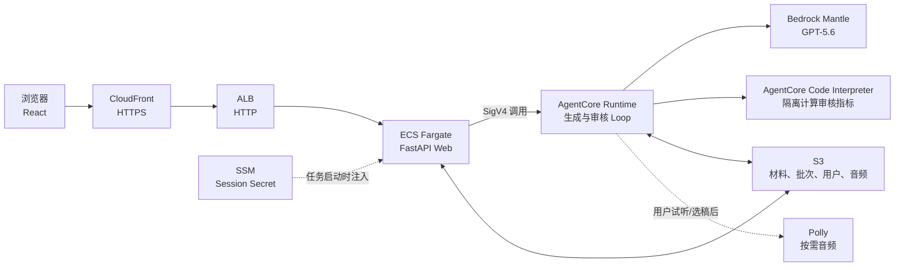
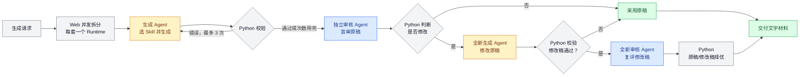

# IELTS Listening Part 1 材料生成系统

这是一个面向 IELTS 出题人员的内部材料生产与审核系统。用户选择场景和数量后，系统生成候选
听力对话及其信息点标注，执行程序校验和独立 AI 盲审，再将候选材料逐套返回浏览器。

系统的边界：

- **自动生成流程交付文字材料**：对话稿、十个信息点、校验结果和审核结果。
- **不自动生成题目或答案**：命题仍是后续人工环节。
- **不在生成流程中合成音频**：用户点击试听或选中材料后，系统才按需调用 Polly。

本 README 面向开发、部署和运维人员。出题人员请阅读
[`USER_GUIDE.md`](USER_GUIDE.md)。

## 1. 项目目录

下面列出版本控制中的主要目录和入口。测试夹具、截图脚本等同类文件只展示其所在目录，避免用
文件清单淹没主线。

```text
.
├── README.md                         # 技术、部署和运维手册
├── USER_GUIDE.md                     # 出题人员使用说明
├── pytest.ini                        # Python 测试发现配置
├── config/
│   └── scenarios.yaml                # 场景分类、角色和场景说明
├── material/
│   └── Part1_选材命制规范.md          # IELTS Part 1 选材与命制规范
├── skills/                           # 两个技能池，各自独立；这个划分就是盲审边界
│   ├── generate/                     # 生成 Agent 的池
│   │   └── generate-listening-part1/
│   │       ├── SKILL.md              # 生成任务入口规范
│   │       ├── references/specification.md
│   │       ├── schemas/              # material、blueprint JSON Schema
│   │       └── scripts/validate_part1.py # 生成结果的确定性校验器
│   ├── audit/                        # 审核 Agent 的池；不含 blueprint schema
│   │   └── audit-listening-part1/
│   │       ├── SKILL.md              # 审核任务入口规范
│   │       ├── references/audit-rubric.md
│   │       ├── schemas/audit.schema.json
│   │       └── scripts/audit_metrics.py  # 审核所需客观指标
│   └── shared/                       # 两侧都不激活的离线工具
│       ├── cross_check.py            # 生成标注与盲审结果交叉检查
│       └── tests/                    # Skill 契约回归测试
├── backend/                          # AgentCore Runtime
│   ├── Dockerfile                    # Runtime ARM64 镜像
│   ├── pyproject.toml                # Python 依赖与 pytest 配置
│   ├── app.py                        # Runtime action 入口
│   ├── request.py                    # 生成请求解析
│   ├── agents.py                     # 两类 Strands Agent、Skill 池和工具权限
│   ├── sandboxed_metrics.py          # 在 AgentCore Code Interpreter 中计算审核指标
│   ├── model/provider.py             # Bedrock Mantle 模型适配
│   ├── steps/
│   │   └── agent_steps.py            # generate、audit、revise 的输入输出边界
│   ├── deterministic/                # 校验、指标、锚点与交叉检查包装
│   ├── orchestration/
│   │   ├── loop.py                   # 单套材料 Agent Loop
│   │   ├── batch.py                  # 批次执行与事件输出
│   │   ├── candidate_store.py        # 候选材料注册
│   │   └── publish.py                # 选稿、试听和异步音频任务
│   ├── scripts/                      # 部署、冒烟和 CI 门禁
│   ├── tests/                        # 后端测试
│   └── docs/                         # 时延、模型接入和交接记录
├── audio_storage/                    # 按需音频与材料状态存储
│   ├── synthesize.py                 # Polly 逐轮合成
│   ├── state_store.py                # pending/approved 等状态迁移
│   ├── manifest.py                   # 音频完整性 manifest
│   ├── config/pronunciation.yaml     # 发音覆盖规则
│   └── tests/
├── web/                              # 面向浏览器的 FastAPI 服务
│   ├── Dockerfile                    # Web + 前端静态资源镜像
│   ├── app.py                        # API、静态文件与认证入口
│   ├── fanout.py                     # 每套一次 Runtime 调用，合并为 SSE
│   ├── runtime_client.py             # SigV4 AgentCore 客户端
│   ├── auth.py                       # 登录、session 和用户存储
│   ├── batch_store.py                # 批次持久化
│   └── tests/
├── frontend/                         # React + TypeScript + Vite 审阅界面
│   ├── src/
│   │   ├── api/                      # Web API 与 SSE 客户端
│   │   ├── auth/                     # 登录状态
│   │   ├── contracts/                # 从 Schema 生成的类型
│   │   ├── domain/                   # 展示与比较逻辑
│   │   ├── features/                 # 场景、进度、阅读、比较、音频
│   │   └── stores/                   # Zustand 状态
│   ├── public/config.json            # 运行时前端配置
│   ├── scripts/                      # codegen 与视觉检查脚本
│   ├── package.json                  # 依赖和 npm 命令
│   ├── vite.config.ts
│   ├── vitest.config.ts
│   └── tsconfig.json
├── deploy/
│   ├── config.sh                     # 共享资源名和部署参数
│   ├── provision.sh                  # S3、ECR、ECS、IAM、日志组
│   ├── runtime.sh                    # 创建/更新 AgentCore Runtime
│   ├── edge.sh                       # ALB、CloudFront、安全组
│   ├── service.sh                    # 构建 Web 镜像并创建 ECS 服务
│   ├── start.sh / stop.sh            # 日常启停
│   ├── status.sh                     # 资源状态与访问地址
│   └── teardown.sh                   # 拆除资源
└── docs/ui/                          # UI 原型
```

## 2. 系统架构



### 2.1 每个组件负责什么

| 组件 | 职责 |
|---|---|
| 浏览器 | 选择场景、显示逐套生成进度、审阅材料、发起试听或选稿 |
| CloudFront + ALB | 提供稳定 HTTPS 地址，将动态请求转发到 Web 服务 |
| Web / ECS | 登录与 session、批次历史、调用 Runtime、把多条结果流合并成 SSE |
| AgentCore Runtime | 创建 Strands Agent，执行生成、校验、盲审、修改和按需音频 action；`PUBLIC` 网络模式用于访问 AWS 公网服务 |
| AgentCore Code Interpreter | 在空白远程环境中运行审核指标脚本；只接收脚本和当前 `material` |
| Bedrock Mantle | 承载生成、审核和修改所需的 GPT-5.6 调用 |
| S3 | 保存候选材料、批次、用户数据、审核状态和按需生成的音频 |
| SSM | 保存 Web session 签名密钥，避免容器重启后用户集体掉线 |
| Polly | 仅在用户主动试听或选稿后合成英式语音 |

### 2.2 一次生成请求如何流转

1. 浏览器向 Web 服务提交场景和数量。
2. `web/fanout.py` 为每套材料分别调用一次 AgentCore Runtime，并按
   `WEB_FANOUT_CONCURRENCY` 控制并发。
3. Runtime 对每套材料执行第 3 节的 Agent Loop，只产出文字材料和质量信息。
4. Web 将多条 Runtime 流合并为一条 SSE；浏览器不必等待整个批次完成，可以逐套看到结果。
5. Web 同时把批次索引和结果保存到 S3，供刷新页面和历史查询使用。

这种 fan-out 让 AgentCore 的 15 分钟同步限制约束**单套材料**，而不是整个批次。Web 使用独立
线程池承载阻塞式 boto3 长连接，避免占满 FastAPI/anyio 默认线程池。

### 2.3 音频为什么不在生成流程里

生成成功后不会调用 Polly。只有以下用户动作才触发音频：

- **试听**：`preview_audio` 为某个候选材料启动异步合成，但不改变选稿状态；
- **选稿**：`select` 确认候选并启动合成；若此前已试听，同一批音频可直接复用。

Runtime 立即返回 job id，浏览器通过 `audio_status` 轮询。合成完成后才能通过
`presign_audio` 获得限时播放地址。这样生成批次不会因为 30 到 45 次 Polly 请求而变慢。

### 2.4 网络与凭证边界

- 浏览器不持有 AWS 凭证，只调用同源 `/api/*`，登录态存放在 HttpOnly cookie。
- Web 使用 ECS task role 的临时凭证签名 `InvokeAgentRuntime`，没有长期 access key。
- Runtime 不直接面向浏览器。当前部署使用 AgentCore `PUBLIC` 网络模式，但调用托管 Runtime
  endpoint 仍需 SigV4 签名和 `bedrock-agentcore:InvokeAgentRuntime` 权限。
- S3 对象全部私有；音频通过预签名 URL 播放。
- CloudFront 禁用缓存和压缩。缓存可能串用不同用户的数据；压缩可能缓冲 SSE，使材料在末尾
  一次性出现。
- Web 每 15 秒发 SSE 心跳；CloudFront origin read timeout 为 60 秒，ALB idle timeout 默认为
  120 秒。三者共同保证长时间生成不会因为静默而断流。

### 2.5 鉴权与用户池

系统**没有使用 Cognito**。注册、登录和 Session 都由 `web/auth.py` 实现，生产环境的用户池是
S3 中的一个 JSON 对象：

```text
s3://ielts-part1-materials-{account}/web/users.json
```

每个用户记录包含标准化邮箱、密码摘要、管理员标记和创建时间。密码不以明文保存，而是使用
PBKDF2-HMAC-SHA256、随机盐和 200,000 次迭代生成摘要。第一个注册的账号自动成为管理员；后续
注册是否允许由 `ALLOWED_EMAIL_DOMAINS` 控制。域名限制只作用于新注册，不会使已有账号失效。

登录成功后，Web 设置有效期 7 天的 `ielts_session` HttpOnly cookie。Cookie 中保存邮箱和过期
时间，并使用 SSM `/ielts-part1/session-secret` 中的密钥做 HMAC-SHA256 签名；服务端不保存
Session 表。每次鉴权除了验证签名和过期时间，还会确认该用户仍存在，因此从用户池删除账号即可
使其现有 Session 失效。

本地开发未配置 `USER_STORE_S3_BUCKET` 时，用户写入
`USER_STORE_PATH`（默认 `/tmp/ielts-web-users.json`）。这套自建方案面向小规模内部使用，不提供
邮箱验证、找回密码、MFA、企业 SSO 或 Cognito 式用户管理后台。

## 3. 生成流程（Agent Loop）



这张图描述的是**一套材料从收到请求到最终交付的完整过程**。黄色节点是负责写作或改稿的生成
Agent，蓝色节点是独立审核 Agent，灰色节点是 Python 程序作出的确定性判断，绿色节点是最终
采用和交付的结果。

整个流程可以按下面的顺序理解：

1. **拆分任务**：用户可以一次申请多套材料。Web 将批次拆开，每套材料分别启动一个独立的
   AgentCore Runtime 请求；不同材料之间可以并行，但互不共享 Agent 会话。
2. **生成初稿**：Runtime 创建生成 Agent，并把具体场景交给它。生成 Agent 激活生成 Skill，
   读取命制规范和 Schema，产出对话稿 `material` 与十个信息点 `blueprint`。
3. **程序验收初稿**：Agent 返回后，Python 重新运行确定性校验。若发现格式、数量或标注错误，
   校验报告会交给一个全新的生成 Agent 重写，最多尝试三次。即使三次后仍有错误，系统也保留
   最后一稿和错误报告，继续进入审核，避免校验器误判导致整套材料消失。
4. **独立盲审**：Python 只把对话稿和客观统计数据交给审核 Agent，不提供生成者的
   `blueprint`。审核 Agent 必须独立判断材料质量并重新找出可命题的信息点，Python 再将两份
   信息点进行交叉检查。
5. **决定是否修改**：如果程序校验、盲审和交叉检查没有需要处理的问题，直接采用原稿；如果
   存在缺陷且剩余时间足够，Python 才启动修改流程。
6. **修改并重新验收**：修改由一个全新的生成 Agent 完成。修改稿先再次通过 Python 校验；
   校验不通过就放弃修改稿、回退原稿，校验通过才交给另一个全新的审核 Agent 从零复评。
7. **择优交付**：原稿和修改稿都有各自的审核结果。Python 按固定规则选择质量更高的一版，
   最终只交付文字材料及其校验、审核信息；音频不属于这条自动生成流程。

因此，这套系统不是让一个 AI 从头到尾自行决定下一步，而是
“**Agent 执行需要理解语言的工作，Python 控制流程并验收结果**”：

- Agent 负责激活 Skill、读取规范、生成、盲审和修改；
- Python 负责拆分任务、控制重试、隔离盲审输入、运行外部校验、决定是否修改并选择最终版本。

Agent 不能凭自己运行过 validator 就宣布通过。Python 会在 Agent 返回后重新校验真实产物。
下面各小节沿着这条流程，说明每一步如何落到代码中。

### 3.1 请求进入单套材料 Loop

一次请求的实际调用链如下：

```text
浏览器 POST /api/invocations（action=generate）
  → web/app.py
  → web/fanout.py：按数量拆成一套一个 ChildPlan
  → web/runtime_client.py：每套使用新的 runtimeSessionId 调用 AgentCore
  → backend/app.py::invoke(payload)
  → backend/request.py::parse_generate_request()
  → backend/orchestration/batch.py::run_batch()
  → backend/orchestration/loop.py::run_one()
  → backend/steps/agent_steps.py::generate()
  → backend/agents.py::build_generate_agent()
  → Strands Agent.invoke_async()
```

Runtime 的 Python 入口是 `backend/app.py` 中的 `@app.entrypoint invoke()`。它读取 payload 的
`action`：`generate` 进入生成流程，`list_scenarios`、`select`、`preview_audio` 等进入各自
action。`backend/request.py` 再把场景 id 和数量展开成 `Scenario`。

Python 最终传给生成 Agent 的不是整套命制规范，而是明确的任务和场景，例如：

```text
Generate one listening material for the scenario below.

id: booking-hotel
category: booking
title: 酒店预订
客户联系酒店前台咨询并预订房间……
```

“这是听力生成任务”目前由三处共同确定：

1. 生成 Agent 的 system prompt 将其定义为 listening-material generation specialist；
2. `agent_steps.generate()` 的请求明确写 `Generate one listening material`；
3. `skills/generate/` 当前只有 Listening Part 1 生成 Skill。

因此当前没有 Listening、Reading、Writing 之间的动态学科路由。

### 3.2 创建本轮所需的 Agent

进入具体 AI 步骤时，Python 根据当前阶段创建生成 Agent 或审核 Agent。Agent 不是运行时生成的
一段新代码；`backend/agents.py` 保存固定定义，Python 每次调用时据此创建一个新的 Strands
`Agent` 对象：

```python
Agent(
    model=provider.build_model(...),
    system_prompt=...,
    plugins=[AgentSkills(skills=Skill.from_directory(...))],
    tools=...,
    sandbox=ReadOnlySkillSandbox(...),
)
```

创建新实例是为了隔离会话：不同材料、生成重试、第一次盲审和修改后复评都不共享对话历史或
Skill 激活状态。

系统有两类 Agent、两个 Skill 池：

| Agent | Skill 池 | 工具 | 用途 |
|---|---|---|---|
| 生成 Agent | `skills/generate/` | `skills`、`file_read`、`shell` | 初稿生成与修改 |
| 审核 Agent | `skills/audit/` | `skills`、`file_read`；**无 shell** | 原稿盲审与修改稿复评 |

修改没有单独的 Skill。修改步骤创建一个全新的生成 Agent，复用生成 Skill，因为修改稿仍须满足
同一份 specification、Schema 和 validator。

### 3.3 Agent 激活并执行 Skill

`backend/agents.py` 使用 Strands SDK 的原生目录加载：

```python
skills = Skill.from_directory("skills/generate")
plugin = AgentSkills(skills=skills)
```

system prompt 要求模型执行下面的过程：

```text
Agent 先看到池内 Skill 的 name + description
  → 根据任务调用 skills("generate-listening-part1")
  → 获得 SKILL.md 和资源清单
  → 用 file_read 打开 reference 与 Schema
  → 生成 Agent 用 shell 运行 Skill 指定的 validator
  → 返回 Skill 规定的 JSON
```

这些动作由模型通过工具调用完成，不是 Python 逐项强制的状态机。当前代码会检查最终 JSON 外壳，
但不会 fail-closed 地证明模型确实激活过 Skill 或执行过内部 validator；因此 Agent 内部校验只用于
提高一次调用的自我修正能力，不能作为可信门禁。真正强制执行的是返回后的 Python 外部校验。

当前两个 Skill 的内容是：

| | 生成 Skill | 审核 Skill |
|---|---|---|
| 目录 | `skills/generate/generate-listening-part1/` | `skills/audit/audit-listening-part1/` |
| 入口 | `SKILL.md` | `SKILL.md` |
| 规范 | `references/specification.md` | `references/audit-rubric.md` |
| Schema | `material.schema.json`、`blueprint.schema.json` | `audit.schema.json` |
| 脚本 | `validate_part1.py` | `audit_metrics.py` |

生成结果的统一外壳是：

```json
{
  "material": {},
  "blueprint": {}
}
```

`material` 是对话稿；`blueprint` 是生成者声明的十个信息点，包括答案、证据句、对话位置和适用
题型。`agent_steps.py` 负责解析这个外壳，并补上模型无法可靠知道的真实模型 id 和 UTC 时间。

### 3.4 生成与双层确定性校验

生成 Agent 被要求在一次调用内部执行完整 Skill 工作流：

1. 读取 specification 和两份 Schema；
2. 生成 `material` 与 `blueprint`；
3. 将临时 JSON 写进本次调用独占的 `/tmp/ielts-gen-*` 目录；
4. 用 `shell` 运行 `validate_part1.py`；
5. 根据报告修改并重新检查；
6. 把两个完整产物放进回复，而不是只留在临时文件。

Agent 调用结束后，`GenerationWorkspace` 无论成功失败都会删除整个临时目录。随后 Python 仍然
执行独立校验：

```text
repair_anchors()
  → validate_part1.py
  → 通过：进入盲审
  → errors：累积反馈给新的生成 Agent，最多三次
```

validator 不调用模型，只检查可明确计算的规则：

- **数据格式**：必填字段、Schema、禁止出现的题目/答案/分析字段；
- **结构数量**：说话人、旁白、十个信息点、字数和轮数；
- **标注一致性**：答案是否在证据句中、`turn_index` 是否指向该句、信息点顺序是否正确。

`warnings` 不触发重生成，只作为修改建议。三次仍有错误时保留最后一稿、继续审核并附上
`validation_findings`；校验是报告，不是扣住材料的闸门。429、空响应、错误 JSON 外壳等调用故障
使用独立的基础设施重试预算，不占三次内容生成机会。

### 3.5 盲审与指标沙箱

盲审前，Python 通过 AgentCore Code Interpreter 计算字数、轮数和前后半段分布。远程环境从空白
开始，只上传：

```text
audit_metrics.py
material.json
```

不会上传 `blueprint`。同一个 Code Interpreter session 可在修改后复评时复用，但只替换
`material.json`，完成后由 `loop.py` 关闭。

审核 Agent 接收的业务输入被 `BlindAuditInput` 固定为两个字段：

```text
material + metrics
```

它激活审核 Skill、读取 rubric，并在看不到本材料 `blueprint` 的情况下独立重建信息点。Python
随后执行纯代码交叉检查：

| 生成者的 `blueprint` | 盲审独立找到 | 结果 |
|---|---|---|
| 入住日期：12 July | 入住日期：12 July | 匹配 |
| 房型：double room | 房型：double room | 匹配 |
| 价格：£85 | 未找到 | 需要检查或修改 |

隔离依靠多道边界：生成/审核 Skill 分池、审核 Agent 无 shell、请求不包含 blueprint、生成临时
目录在审核前删除、审核前执行 `assert_no_plan_on_disk()`、远程指标环境只上传两个白名单文件。

### 3.6 修改、独立复评与择优

如果原稿审核和交叉检查都干净，Python 直接交付原稿。否则在时间预算允许时：

1. `loop.py` 将审核缺陷和交叉检查结果整理成 must-fix / advisory；
2. 创建全新的生成 Agent，使用同一生成 Skill 输出完整修改版 `material + blueprint`；
3. Python 修复/核验锚点并再次运行 validator；
4. 修改稿不通过则回退到已经审核过的原稿；
5. 修改稿通过后，创建全新的审核 Agent，从零盲审修改稿；
6. Python 对原稿和修改稿执行 `pick_better()`，平分时选择修改稿。

第一次盲审和复评是同一种 Agent 配置，但不是同一个实例或会话。复评 Agent 看不到第一次审核结论
和修改指令，避免只针对已知问题寻找证据。

### 3.7 并发与时间预算

生产环境由 `web/fanout.py` 为每套材料发起一个独立 Runtime invocation，每个请求使用新的
`runtimeSessionId`。`WEB_FANOUT_CONCURRENCY=6` 表示同时最多运行 6 套，不是每批最多 6 套：
第一个任务完成后，队列中的下一套立即开始。这个数是可调的流量保护值，不是 AgentCore 硬限制；
出现 429 时应下调。

单个 Runtime invocation 只处理一套材料，因此 Runtime 内部并发实际为 1；AgentCore 的 15 分钟
同步限制约束单套材料。时间不足时可以跳过可选修改，但不会中断已经完成审核的原稿。

### 3.8 核心代码索引

| 路径 | 作用 |
|---|---|
| `web/fanout.py` | 将批次拆成每套一次 Runtime 调用，限制并发并合并 SSE |
| `web/runtime_client.py` | SigV4 调用 AgentCore，创建独立 session |
| `backend/app.py` | AgentCore Python 入口和 action 路由 |
| `backend/request.py` | 把场景 id、数量和自定义场景解析为 slot |
| `backend/orchestration/batch.py` | 单次 Runtime 的时间预算、补生成和事件输出 |
| `backend/orchestration/loop.py` | 单套材料的重试、校验、盲审、修改、复评和择优 |
| `backend/agents.py` | Strands Agent、Skill 池、工具和只读 Skill sandbox |
| `backend/steps/agent_steps.py` | 三类模型调用的消息与输入输出边界 |
| `backend/deterministic/anchors.py` | 可确定修复的 blueprint 锚点同步 |
| `backend/deterministic/validate.py` | Python 调用生成 Skill validator 的包装 |
| `backend/deterministic/crosscheck.py` | blueprint 与盲审信息图交叉检查 |
| `backend/sandboxed_metrics.py` | Code Interpreter session 与白名单文件上传 |

### 3.9 如何扩展到其他 IELTS 能力

**增加采用同类工作流的 Skill**：在对应池中增加一个包含 `SKILL.md` 的目录，并提供它声明的
references、Schema 和 scripts。`Skill.from_directory()` 会自动发现 Skill，无需在 `agents.py`
写新的目录名。

```text
skills/
├── generate/
│   ├── generate-listening-part1/
│   └── generate-reading-passage1/       # 示例，当前不存在
└── audit/
    ├── audit-listening-part1/
    └── audit-reading-passage1/          # 示例，当前不存在
```

但“能发现 Skill”不等于新学科已经端到端可用。当前这些地方仍是 Listening Part 1 专用的：

- 请求和场景模型，以及 `Generate one listening material` 任务消息；
- `GenOutput` 与 Loop 固定使用 `material + blueprint`；
- `backend/paths.py` 按固定文件名在整个池中唯一解析 `validate_part1.py` 和
  `audit_metrics.py`；加入第二份同名脚本会产生歧义，不同文件名又不会自动进入外层 Loop；
- 锚点修复、交叉检查、审核输入和择优规则；
- 前端的场景选择、材料展示和审阅交互。

扩展 Reading/Writing 时还需要增加明确的 capability/task 路由、对应输入与产物契约、确定性脚本、
适合该学科的 Loop 策略和前端页面。不要只把新 Skill 放进池里就让模型自由猜任务；Python 应先
根据用户请求确定能力，再让 Agent 在最小必要 Skill 池中工作。

最终交付仍是候选文字材料及其校验、审核信息。音频属于用户后续主动操作。

## 4. 部署前准备

### 4.1 工具与 AWS 条件

- AWS CLI v2，凭证可调用目标账号；
- Docker，能构建 `linux/arm64` 镜像；
- Python 3.12（项目声明最低 `>=3.11`，部署和测试建议统一使用 3.12）；
- Node.js 20+ 与 npm；
- AWS 区域必须是 `us-east-1` 或 `us-east-2`；脚本会拒绝其他区域，因为当前 GPT-5.6
  接入不提供跨区推理；
- 默认 VPC 中至少有两个位于不同可用区、可分配公网 IP 的子网；也可显式传入 VPC 与子网。

先确认身份和区域：

```bash
aws sts get-caller-identity
export AWS_REGION=us-east-1
```

### 4.2 两类 IAM 权限

不要混淆下面两类身份：

1. **部署者身份**：你当前的 IAM user/role，负责执行 `deploy/*.sh`、构建并推送镜像；
2. **运行期角色**：`provision.sh` 创建的三个项目角色，由 ECS 和 AgentCore 在运行时承担。

部署者必须能够创建运行期角色，并通过 `iam:PassRole` 把角色交给 ECS/AgentCore。

### 4.3 部署者 IAM policy

下面策略覆盖当前 `provision`、镜像推送、`runtime`、`edge`、`service`、日常启停、状态查询和
`teardown` 脚本。它以可直接提交给 IAM 的 JSON 表示，不含需要替换的账号占位符；资源创建与
查询动作使用 `"Resource": "*"`，IAM 角色操作则限制为 `ielts-part1-*`。

> 这是覆盖当前脚本的项目部署策略，不是严格的最小权限基线。ECS、EC2、ELB、CloudFront 和
> AgentCore 的创建/查询动作中有一部分使用 `"Resource": "*"`；建议通过专用部署 role、
> permissions boundary 或组织 SCP 进一步限制账号和区域。若组织要求 KMS、强制标签或私有
> 网络，还需由云平台管理员补充相应条件。

```json
{
  "Version": "2012-10-17",
  "Statement": [
    {
      "Sid": "ReadCallerIdentity",
      "Effect": "Allow",
      "Action": "sts:GetCallerIdentity",
      "Resource": "*"
    },
    {
      "Sid": "CreateProjectBucket",
      "Effect": "Allow",
      "Action": "s3:CreateBucket",
      "Resource": "*"
    },
    {
      "Sid": "ManageProjectBucket",
      "Effect": "Allow",
      "Action": [
        "s3:DeleteBucket",
        "s3:GetBucketLocation",
        "s3:GetBucketVersioning",
        "s3:ListBucket",
        "s3:ListBucketVersions",
        "s3:PutBucketVersioning",
        "s3:PutBucketPublicAccessBlock",
        "s3:PutEncryptionConfiguration"
      ],
      "Resource": "arn:aws:s3:::ielts-part1-materials-*"
    },
    {
      "Sid": "ManageProjectBucketObjects",
      "Effect": "Allow",
      "Action": [
        "s3:GetObject",
        "s3:PutObject",
        "s3:DeleteObject",
        "s3:DeleteObjectVersion"
      ],
      "Resource": "arn:aws:s3:::ielts-part1-materials-*/*"
    },
    {
      "Sid": "EcrAuthorization",
      "Effect": "Allow",
      "Action": "ecr:GetAuthorizationToken",
      "Resource": "*"
    },
    {
      "Sid": "ProjectEcrRepositories",
      "Effect": "Allow",
      "Action": [
        "ecr:CreateRepository",
        "ecr:DeleteRepository",
        "ecr:DescribeRepositories",
        "ecr:DescribeImages",
        "ecr:ListImages",
        "ecr:PutImageTagMutability",
        "ecr:BatchCheckLayerAvailability",
        "ecr:GetDownloadUrlForLayer",
        "ecr:BatchGetImage",
        "ecr:InitiateLayerUpload",
        "ecr:UploadLayerPart",
        "ecr:CompleteLayerUpload",
        "ecr:PutImage"
      ],
      "Resource": "arn:aws:ecr:*:*:repository/ielts-part1-*"
    },
    {
      "Sid": "ProjectEcsAndNetworking",
      "Effect": "Allow",
      "Action": [
        "ecs:CreateCluster",
        "ecs:DeleteCluster",
        "ecs:DescribeClusters",
        "ecs:RegisterTaskDefinition",
        "ecs:CreateService",
        "ecs:UpdateService",
        "ecs:DeleteService",
        "ecs:DescribeServices",
        "ecs:ListTasks",
        "ecs:DescribeTasks",
        "ec2:DescribeVpcs",
        "ec2:DescribeSubnets",
        "ec2:DescribeSecurityGroups",
        "ec2:DescribeNetworkInterfaces",
        "ec2:CreateSecurityGroup",
        "ec2:DeleteSecurityGroup",
        "ec2:AuthorizeSecurityGroupIngress",
        "ec2:RevokeSecurityGroupIngress"
      ],
      "Resource": "*"
    },
    {
      "Sid": "ProjectLoadBalancerAndCdn",
      "Effect": "Allow",
      "Action": [
        "elasticloadbalancing:CreateLoadBalancer",
        "elasticloadbalancing:DeleteLoadBalancer",
        "elasticloadbalancing:DescribeLoadBalancers",
        "elasticloadbalancing:ModifyLoadBalancerAttributes",
        "elasticloadbalancing:CreateTargetGroup",
        "elasticloadbalancing:DeleteTargetGroup",
        "elasticloadbalancing:DescribeTargetGroups",
        "elasticloadbalancing:DescribeTargetHealth",
        "elasticloadbalancing:ModifyTargetGroupAttributes",
        "elasticloadbalancing:CreateListener",
        "elasticloadbalancing:DescribeListeners",
        "cloudfront:CreateDistribution",
        "cloudfront:GetDistribution",
        "cloudfront:GetDistributionConfig",
        "cloudfront:ListDistributions",
        "cloudfront:UpdateDistribution",
        "cloudfront:DeleteDistribution"
      ],
      "Resource": "*"
    },
    {
      "Sid": "ProjectRuntime",
      "Effect": "Allow",
      "Action": [
        "bedrock-agentcore:CreateAgentRuntime",
        "bedrock-agentcore:UpdateAgentRuntime",
        "bedrock-agentcore:GetAgentRuntime",
        "bedrock-agentcore:ListAgentRuntimes",
        "bedrock-agentcore:DeleteAgentRuntime"
      ],
      "Resource": "*"
    },
    {
      "Sid": "ProjectSessionSecret",
      "Effect": "Allow",
      "Action": [
        "ssm:GetParameter",
        "ssm:PutParameter"
      ],
      "Resource": "arn:aws:ssm:*:*:parameter/ielts-part1/session-secret"
    },
    {
      "Sid": "DescribeLogs",
      "Effect": "Allow",
      "Action": "logs:DescribeLogGroups",
      "Resource": "*"
    },
    {
      "Sid": "ProjectLogs",
      "Effect": "Allow",
      "Action": [
        "logs:CreateLogGroup",
        "logs:DeleteLogGroup",
        "logs:PutRetentionPolicy",
        "logs:GetLogEvents"
      ],
      "Resource": [
        "arn:aws:logs:*:*:log-group:/ecs/ielts-part1-web",
        "arn:aws:logs:*:*:log-group:/ecs/ielts-part1-web:*"
      ]
    },
    {
      "Sid": "ManageProjectRoles",
      "Effect": "Allow",
      "Action": [
        "iam:CreateRole",
        "iam:GetRole",
        "iam:PutRolePolicy",
        "iam:DeleteRolePolicy",
        "iam:ListRolePolicies",
        "iam:AttachRolePolicy",
        "iam:DetachRolePolicy",
        "iam:ListAttachedRolePolicies",
        "iam:DeleteRole"
      ],
      "Resource": "arn:aws:iam::*:role/ielts-part1-*"
    },
    {
      "Sid": "CreateRequiredServiceLinkedRoles",
      "Effect": "Allow",
      "Action": "iam:CreateServiceLinkedRole",
      "Resource": "*",
      "Condition": {
        "StringEquals": {
          "iam:AWSServiceName": [
            "ecs.amazonaws.com",
            "elasticloadbalancing.amazonaws.com"
          ]
        }
      }
    },
    {
      "Sid": "PassRuntimeRoleToAgentCore",
      "Effect": "Allow",
      "Action": "iam:PassRole",
      "Resource": "arn:aws:iam::*:role/ielts-part1-runtime",
      "Condition": {
        "StringEquals": {
          "iam:PassedToService": "bedrock-agentcore.amazonaws.com"
        }
      }
    },
    {
      "Sid": "PassEcsRolesToEcsTasks",
      "Effect": "Allow",
      "Action": "iam:PassRole",
      "Resource": [
        "arn:aws:iam::*:role/ielts-part1-ecs-exec",
        "arn:aws:iam::*:role/ielts-part1-web-task"
      ],
      "Condition": {
        "StringEquals": {
          "iam:PassedToService": "ecs-tasks.amazonaws.com"
        }
      }
    }
  ]
}
```

`iam:PassRole` 风险较高：它允许 AWS 服务以指定角色运行。不要把它改成不受限的
`"Resource": "*"`，也不要移除 `iam:PassedToService` 条件。

`iam:CreateServiceLinkedRole` 只允许 ECS 和 Elastic Load Balancing 创建各自的服务关联角色。
账号中已经存在这些角色时不会再次创建；新账号若缺少这项权限，首次创建 ECS service 或 ALB
可能在部署中途失败。

策略按默认资源名限制 S3 桶为 `ielts-part1-materials-*`。如果通过 `S3_BUCKET` 改成其他前缀，
必须同步修改策略中的两个 S3 ARN，否则 `provision.sh` 会在建桶或写入配置时被拒绝。

将策略保存为本地 `ielts-part1-deployer-policy.json` 后，可用 CLI 创建并附加：

```bash
ACCOUNT_ID=$(aws sts get-caller-identity --query Account --output text)

aws iam create-policy \
  --policy-name IELTSPart1Deployer \
  --policy-document file://ielts-part1-deployer-policy.json

# 附加到当前用于部署的 role：
aws iam attach-role-policy \
  --role-name <DEPLOYER_ROLE_NAME> \
  --policy-arn arn:aws:iam::${ACCOUNT_ID}:policy/IELTSPart1Deployer

# 如果使用 IAM user，则改用：
aws iam attach-user-policy \
  --user-name <DEPLOYER_USER_NAME> \
  --policy-arn arn:aws:iam::${ACCOUNT_ID}:policy/IELTSPart1Deployer
```

创建和附加 managed policy 的操作者本身还需要 `iam:CreatePolicy` 以及
`iam:AttachRolePolicy` 或 `iam:AttachUserPolicy`。通常这一步由账号管理员执行；获得部署者权限
后，日常部署不需要这些管理动作。

### 4.4 脚本创建的运行期角色

| 角色 | 使用者 | 核心权限 |
|---|---|---|
| `ielts-part1-ecs-exec` | ECS 平台 | 拉取 Web 镜像、写日志、读取 session secret |
| `ielts-part1-web-task` | Web 应用 | 调用 AgentCore、读写项目 S3 桶 |
| `ielts-part1-runtime` | AgentCore | 调用模型、Code Interpreter 和 Polly，读写项目 S3 桶 |

这些策略由 `deploy/provision.sh` 和 `deploy/service.sh` 自动创建，无需手工复制。
`bedrock-mantle:*` 与 `bedrock:*` 是不同权限前缀；Runtime 调用 GPT-5.6 需要脚本中列出的
Mantle 权限，不能只授予 `bedrock:InvokeModel`。盲审指标还需要
`bedrock-agentcore:StartCodeInterpreterSession`、`InvokeCodeInterpreter` 和
`StopCodeInterpreterSession` 等权限；当前 Runtime 内联策略已经包含。

## 5. 从零部署

所有命令从仓库根目录执行。

```bash
# 0. 选择区域并确认身份
export AWS_REGION=us-east-1
aws sts get-caller-identity

# 1. 创建 S3、ECR、ECS cluster、日志组和三个运行期角色
bash deploy/provision.sh

# provision.sh 当前不会设置 tag mutability；显式锁住两个 repository，保证旧标签不会被覆盖
aws ecr put-image-tag-mutability \
  --repository-name ielts-part1-backend \
  --image-tag-mutability IMMUTABLE
aws ecr put-image-tag-mutability \
  --repository-name ielts-part1-frontend \
  --image-tag-mutability IMMUTABLE

# 为本次部署选择一个未使用过的不可变标签
export RELEASE_TAG=20260801-agent-autonomy

# 2. 构建并推送 AgentCore Runtime 镜像
bash backend/scripts/deploy.sh \
  "$(aws sts get-caller-identity --query Account --output text).dkr.ecr.${AWS_REGION}.amazonaws.com/ielts-part1-backend" \
  "$RELEASE_TAG"

# 3. 创建 AgentCore Runtime
bash deploy/runtime.sh "$RELEASE_TAG"

# 4. 创建 ALB、CloudFront、目标组和网络规则
bash deploy/edge.sh

# 5. 构建 Web 镜像并创建 ECS 服务
# 公网使用前必须限制可注册邮箱域名
ALLOWED_EMAIL_DOMAINS=example.com bash deploy/service.sh "$RELEASE_TAG"

# 6. 将 ECS 服务扩到 1，并打印访问地址
bash deploy/start.sh
```

建议先执行 `edge.sh` 再执行 `service.sh`。ECS 不能给已存在且未配置负载均衡器的服务原地增加
ALB；顺序相反时，`service.sh` 会明确删除并重建服务。

`provision.sh` 当前只创建 repository，不设置 tag mutability，所以上面的两条命令不能省略。
`deploy.sh`、`runtime.sh` 和 `service.sh` 都要求显式传入 tag。不要复用 `dev` 或覆盖旧标签；
回退是重新执行 `runtime.sh <known-good-tag>` 和 `service.sh <known-good-tag>`，明确指向已验证
镜像。

### 5.1 验证

```bash
bash deploy/status.sh
curl -si https://<CLOUDFRONT_DOMAIN>/healthz | head -1
```

健康检查应返回 `HTTP/2 200` 或 `HTTP/1.1 200`。新 CloudFront 分发通常需要 5 到 10 分钟变为
`Deployed`，传播期间出现 502/503 不一定表示应用部署失败。

### 5.2 日常更新与启停

更新时使用新的发布标签重新构建镜像，再明确切换 Runtime 和 Web。旧标签保留用于回退：

```bash
export RELEASE_TAG=20260802-fix-1
bash backend/scripts/deploy.sh \
  "$(aws sts get-caller-identity --query Account --output text).dkr.ecr.${AWS_REGION}.amazonaws.com/ielts-part1-backend" \
  "$RELEASE_TAG"
bash deploy/runtime.sh "$RELEASE_TAG"
ALLOWED_EMAIL_DOMAINS=example.com bash deploy/service.sh "$RELEASE_TAG"

bash deploy/stop.sh    # ECS desiredCount=0；保留 ALB、CloudFront 和稳定 URL
bash deploy/start.sh   # ECS desiredCount=1；等待服务稳定
bash deploy/status.sh
```

`stop.sh` 只停止 Fargate 任务。ALB 仍有固定费用，CloudFront 地址继续存在但在无健康目标时返回
503。

### 5.3 拆除

```bash
bash deploy/teardown.sh --yes
bash deploy/teardown.sh --yes --purge-s3
```

第一条保留 S3 数据，因此仍会产生少量存储费用；第二条连同桶内所有对象版本一起删除。脚本
不会删除 SSM 中的 `/ielts-part1/session-secret`，也不会注销历史 ECS task definition revision；
需要完全清理账号时应另行删除。拆除 CloudFront 后原 `*.cloudfront.net` 地址无法恢复，重建会
获得新域名。部分 AWS 删除是异步的，若目标组或安全组仍被引用，等待一分钟后重新执行同一命令。

## 6. 部署资源与配置

### 6.1 创建的主要资源

| 资源 | 名称 |
|---|---|
| S3 bucket | `ielts-part1-materials-{account}` |
| ECR repositories | `ielts-part1-backend`、`ielts-part1-frontend` |
| ECS cluster/service | `ielts-part1` / `ielts-part1-web` |
| ECS task definition | `ielts-part1-web`，ARM64，0.5 vCPU / 1 GB |
| AgentCore Runtime | `ielts_part1_runtime` |
| AgentCore Code Interpreter | 内置 `aws.codeinterpreter.v1`，按材料创建临时 session |
| CloudWatch log group | `/ecs/ielts-part1-web`，保留 7 天 |
| SSM SecureString | `/ielts-part1/session-secret` |
| ALB / target group | `ielts-part1-alb` / `ielts-part1-tg` |
| CloudFront | 以 ALB 为 origin 的动态分发 |

### 6.2 部署参数

`deploy/config.sh` 中的值均可通过环境变量覆盖：

| 变量 | 默认值 | 说明 |
|---|---|---|
| `AWS_REGION` | `us-east-1` | 仅支持 `us-east-1` / `us-east-2` |
| `ACCOUNT_ID` | 从当前凭证发现 | 目标账号 |
| `AWS_PROFILE` | 未设置 | 可选命名 profile |
| `S3_BUCKET` | `ielts-part1-materials-{account}` | 项目单桶 |
| `VPC_ID` | 默认 VPC | 目标 VPC |
| `SUBNET_IDS` | 默认 VPC 的公有子网 | ALB 至少需要两个不同 AZ 的子网 |
| `SUBNET_ID` | `SUBNET_IDS` 第一个 | Fargate 任务子网 |
| `INGRESS_CIDR` | `0.0.0.0/0` | ALB ingress；收窄到办公网会阻断 CloudFront 回源 |
| `ALB_IDLE_TIMEOUT` | `120` | 必须显著大于 SSE 心跳 |
| `TASK_CPU` / `TASK_MEMORY` | `512` / `1024` | Web 任务规格 |

当前 ALB origin 可通过公网 HTTP 直接访问。若要阻止绕过 CloudFront，需要额外实现 CloudFront
origin-facing 托管前缀列表和自定义 header 校验；现有脚本未实现这一层。

### 6.3 Web 运行参数

| 变量 | 默认值 | 说明 |
|---|---|---|
| `ALLOWED_EMAIL_DOMAINS` | `*` | 允许注册的邮箱域名；公网部署必须显式限制 |
| `SESSION_SECRET` | 无 | `service.sh` 生成并从 SSM 注入 |
| `AGENT_RUNTIME_ARN` | 部署时注入 | Runtime ARN |
| `IELTS_AUDIO_BUCKET` | 项目 S3 桶 | 材料与按需音频存储 |
| `USER_STORE_S3_BUCKET` | 项目 S3 桶 | 用户存储；本地未设时回退为本地 JSON |
| `USER_STORE_S3_KEY` | `web/users.json` | 用户文件 key |
| `WEB_FANOUT_CONCURRENCY` | `6` | 同时运行的 Runtime 调用数；429 时下调 |
| `WEB_SSE_HEARTBEAT` | `15` | SSE 心跳秒数 |
| `WEB_RUNTIME_READ_TIMEOUT` | `900` | Runtime 读取超时 |
| `WEB_PER_MATERIAL_WALL` | `900` | 单套材料墙上时钟预算 |

### 6.4 Runtime 参数

| 变量 | 默认值 | 说明 |
|---|---|---|
| `IELTS_MODEL_ID` | `openai.gpt-5.6-terra` | 模型 id |
| `IELTS_MODEL_REGION` | `AWS_REGION` | 模型区域 |
| `IELTS_MODEL_AUTH` | `mantle` | `bearer` 仅适合本地临时调试 |
| `IELTS_CODE_INTERPRETER_REGION` | `AWS_REGION` | 审核指标 Code Interpreter 区域 |
| `IELTS_CODE_INTERPRETER_ID` | `aws.codeinterpreter.v1` | 内置 Code Interpreter identifier |
| `IELTS_CONCURRENCY` | `6` | Runtime 内并发槽；Web 单套调用时实际夹到 1 |
| `IELTS_HARD_LIMIT` | `900` | 平台同步上限 |
| `IELTS_P95_PER_MATERIAL` | `240` | 预算估算值 |
| `IELTS_REVISION_COST` | `120` | 修改与复评预算 |
| `IELTS_SAFETY_MARGIN` | `90` | 收尾余量 |
| `IELTS_MAX_REFILL_ROUNDS` | `2` | 批次缺项后的补生成轮数 |
| `IELTS_SCRIPT_TIMEOUT` | `60` | 确定性脚本超时 |

前端运行时配置位于 `frontend/public/config.json`。告警阈值目前带
`CALIBRATED: false`，表示它们是启发式参考值，尚未通过足量真实材料校准。

## 7. S3 数据结构

```text
s3://ielts-part1-materials-{account}/
├── pending/{scenario_key}/{material_id}/
│   ├── material.json
│   ├── blueprint.json
│   ├── audit.json
│   └── audio/
│       ├── turn_000.mp3 ...
│       └── manifest.json
├── approved/{scenario_key}/{material_id}/
├── rejected/{scenario_key}/{material_id}/
├── production/{scenario_key}/{material_id}/
├── _history/{material_id}/{timestamp}-{source}-{target}.json
├── _batches/{batch_id}/
│   ├── index.json
│   └── materials/{material_id}.json
├── _candidates/{material_id}.json
├── _candidates/{material_id}.job.json
├── _claims/{group_key}.json
└── web/users.json
```

- 自动生成结束后，候选信息写入 `_candidates/` 和批次空间；不会自动出现音频。
- 未选候选保留 30 天，期间可以跨日审阅和提交；过期后不再允许选稿。
- 用户试听或选稿后才创建 `audio/`。`manifest.json` 最后写入，是“音频完整”的哨兵；没有
  manifest 的目录不会被当作完整音频交付。
- `_history/` 保存状态迁移审计记录，不随材料跨状态目录移动。
- 桶开启版本控制，便于恢复被错误修订覆盖的材料。

## 8. 本地开发与测试

### 8.1 Python

```bash
python3.12 -m venv .venv-backend
.venv-backend/bin/pip install -e 'backend[dev]'

python3 skills/shared/tests/run_tests.py
python3 audio_storage/tests/run_tests.py
.venv-backend/bin/python -m pytest backend/tests -q
.venv-backend/bin/python web/tests/run_tests.py
bash backend/scripts/ci_gates.sh
```

### 8.2 前端

```bash
cd frontend
npm ci
npm run verify
npm run dev
```

`npm run verify` 依次检查 Schema/场景/fixture codegen、TypeScript、Oxlint 和 Vitest。前端契约类型
由共享 Schema 生成，不应手工修改生成文件。

### 8.3 AWS 冒烟

以下命令会访问真实 AWS 服务并可能产生模型或 Polly 费用：

```bash
.venv-backend/bin/python backend/scripts/smoke_model.py
.venv-backend/bin/python backend/scripts/run_one.py --scenario booking-hotel
bash backend/scripts/check_ping.sh
```

## 9. 运维与排障

| 现象 | 检查与处理 |
|---|---|
| CloudFront 503，`running=0` | 服务已停止，执行 `bash deploy/start.sh` |
| CloudFront 502，任务在运行 | 查看目标组健康状态和 `/ecs/ielts-part1-web` 日志 |
| 新分发暂时 502/503 | 等待 `status.sh` 显示 CloudFront `Deployed` |
| 生成流中途断开 | 核对 15 秒心跳、CloudFront 60 秒 origin read、ALB 120 秒 idle |
| 材料在结尾一次性出现 | 检查 CloudFront `Compress` 必须为 `false` |
| 模型返回 429 | 下调 `WEB_FANOUT_CONCURRENCY`，不要盲目增加重试 |
| `bedrock-mantle:CreateInference` denied | Runtime 角色缺少 Mantle 权限，重新运行 `provision.sh` 或核对内联策略 |
| Code Interpreter 创建或调用失败 | 核对 Runtime 角色的 Code Interpreter 权限和 `IELTS_CODE_INTERPRETER_REGION` |
| 生成 Agent 一直等待工具确认 | 确认代码通过 `agents.py` 设置了非交互 shell 环境变量 |
| `invalid_api_key` / security token invalid | 先运行 `aws sts get-caller-identity` 检查本地凭证是否过期 |
| 试听后长时间无音频 | 查看 `_candidates/{material_id}.job.json`；首次合成通常需 1 到 2 分钟 |
| 登录后随机失效 | 核对 ECS task definition 是否从 SSM 注入同一个 `SESSION_SECRET` |
| `teardown` 无法删除目标组/安全组 | AWS 仍在释放 ALB/ENI，等待一分钟后重跑 |
| CloudFront 无法删除 | 分发必须先 disable 并完成传播；等待后重跑 `teardown.sh` |

日志位置：

- Web：CloudWatch `/ecs/ielts-part1-web`；
- Runtime：AgentCore 自动创建的 Runtime 日志组。

## 10. 安全与已知限制

### 安全边界

- 仓库不保存 access key、账号 id 或 session secret；
- S3 开启四项 public access block 和 SSE-S3；
- session 使用 HttpOnly cookie，签名密钥保存在 SSM SecureString；
- 运行期使用三个职责分离的 IAM role；
- 当前未配置 WAF、MFA、集中审计日志或 CloudFront 自定义错误页；
- 当前 ALB origin 可被知道主机名的人通过公网 HTTP 绕过 CloudFront。

### 已知限制

- 前端均匀度阈值尚未用足量真实样本校准；
- `WEB_FANOUT_CONCURRENCY=6` 是起始配置，不是所有账号配额下的保证值；
- 版权原因，真题样本不随仓库分发，相关测试会 skip；
- ECS 服务默认单任务、单任务子网，无自动伸缩、蓝绿部署或应用级多可用区冗余；
- 用户池是单个 S3 JSON 对象，更新采用整文件读写；进程锁只能保护单实例。扩展到多个 Web task
  前应迁移到支持条件写或事务的用户存储，避免并发注册相互覆盖；
- 生成 Agent 的 `shell` 与两个 Agent 的 `file_read` 是 Strands 本地工具，不受
  `ReadOnlySkillSandbox` 完整约束；盲审安全依赖 Skill 分池、审核侧无 shell、blueprint 不进入
  请求、生成临时目录清理和 Code Interpreter 白名单上传等多道防线；
- 当前只实现 Listening Part 1；Skill 池可以发现新目录，但 Reading/Writing 的请求路由、产物契约、
  Loop 和前端尚未实现；
- `stop.sh` 不删除 ALB，因此不能把常驻成本降为零；
- `teardown.sh` 默认保留 S3，且始终保留 SSM secret 和历史 task definition revision；
- GPT-5.6 当前部署限制在 `us-east-1` / `us-east-2`。

## 声明

本项目产出原创练习材料，不复制真题内容，也不代表 IELTS、Cambridge 或 British Council 的
授权或背书。
