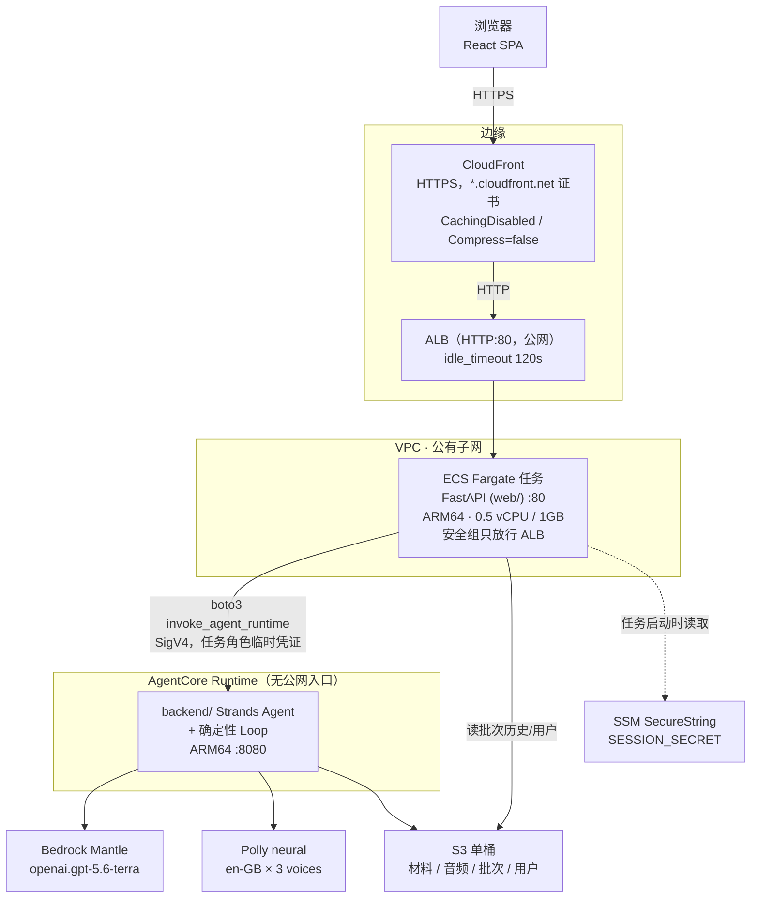
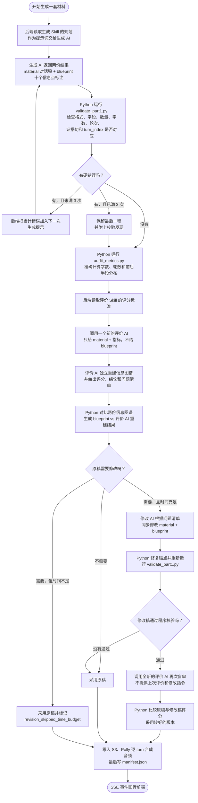

# IELTS Listening Part 1 材料自动生成系统 · 技术部署手册

勾选场景，自动产出符合命制规范的雅思听力 Part 1 材料：对话脚本 + 信息点标注 + 英式口音语音，
并进入可对接的审核流转。

系统只产出**材料**，不产出题目与答案——命题是后续人工环节。因此材料的唯一质量意义在于
「能否支撑后续命题」，这也是题型适配性成为核心验收维度的原因。

面向使用者（出题人员）的说明见 [`USER_GUIDE.md`](USER_GUIDE.md)。本文件面向部署与运维。

---

## 1. 系统架构



几个约束是结构性的，不是风格选择：

- **浏览器永远不持有 AWS 凭证。** 前端只与 web 层自己的 `/api/*` 通信，登录是同源 HttpOnly
  session cookie。web 层用 ECS 任务角色的临时凭证代签调用 AgentCore。系统里没有任何长期密钥。
- **AgentCore Runtime 没有公网入口。** 只有携带 `bedrock-agentcore:InvokeAgentRuntime` 的调用
  方能进。
- **CloudFront 必须关缓存、关压缩。** 产品的核心是材料逐套流式返回；gzip 会把渐进流变成一个
  在结尾一次性交付的整块，缓存会把 A 用户的批次历史发给 B 用户。
- **`Compress: false` + 15 秒 SSE 心跳 + 120s ALB idle** 三者配套。实测一个 8 套的真实批次，
  事件之间最长静默 **96 秒**（216.6s → 313.0s），而 CloudFront 的 origin read 上限是 60 秒。
  加心跳后最长间隔降到 17 秒。**不要删心跳**，删掉就是流被中途切断。

### 每套材料一次独立调用（fan-out）

`web/fanout.py` 为批次里**每一套材料**发一次独立的 `invoke_agent_runtime`，再把 N 条流合并成
一条 SSE 返回浏览器。

这条设计决定了两件事：AgentCore 的 15 分钟同步硬限约束的是**单套**（实测 146–230s，离 900s
很远），所以**没有单批上限**；以及并发不再由后端内部决定，而由 web 层的
`WEB_FANOUT_CONCURRENCY`（默认 6）控制。模型侧出 429 时下调它，不要靠重试，也不要把批量上限
加回来。

合并用一个**专用 ThreadPoolExecutor**，不是 anyio 默认的 40 线程池——后者会被长连接占满，
导致其他请求（含 `/healthz`）排队。

---

## 2. 生成流程（Agent Loop）

这里的 Agent Loop 不是“AI 自己决定下一步做什么”，而是一段由
`backend/orchestration/loop.py` 控制的 Python 工作流。AI 只在被调用时完成生成、评价或修改；
是否重试、是否修改、最终采用哪个版本，都由普通 Python 条件判断决定。

Skill 也不是一个会自行运行的 Agent，而是一组提供给后端使用的材料：

| 组成 | 作用 | 谁使用 |
|---|---|---|
| `SKILL.md`、`references/*.md` | 生成规范或评价标准，作为提示词交给模型 | AI |
| `scripts/*.py` | 字段、数量、字数、轮次等可机械计算的检查 | Python |
| `schemas/*.json` | 约束输入输出的数据结构 | Python / AI 输出契约 |

生成 Skill 和评价 Skill 在流程中的职责如下：

```text
generate-ielts-listening-part1/
├── SKILL.md + references/specification.md   指导生成 AI
└── scripts/validate_part1.py                程序化校验生成结果

audit-ielts-listening-part1/
├── SKILL.md + references/audit-rubric.md    指导评价 AI
└── scripts/audit_metrics.py                 程序化计算评价所需指标
```

一套材料从生成到交付的实际流程：



### 2.1 什么是确定性校验

`validate_part1.py` 属于生成 Skill，但它由后端 Python 直接执行，不由生成 AI 调用或判定。
它只检查能够明确计算的条件，例如：

- JSON 是否包含规定字段，是否出现 `questions`、`answer_key`、`analysis` 等禁止字段；
- 是否正好有三个说话人、三段旁白和十个信息点；
- 对话是否在 450-750 词、20-48 轮的硬范围内；
- 每个信息点的答案是否出现在证据句中；
- `turn_index` 指向的对话轮是否真的包含该证据句；
- 十个信息点是否按顺序分布在正确的前后半段，并满足题型和干扰项要求。

它不会理解“对话自然不自然”或“难度像不像 IELTS”。相同输入每次得到相同结果，所以称为
确定性校验。`errors` 会触发重新生成，`warnings` 只作为后续修改建议。

### 2.2 什么是盲审

生成 AI 会同时交付对话稿 `material` 和自己的十个信息点计划 `blueprint`。评价 AI 只看到
`material` 和 `audit_metrics.py` 算出的客观指标，看不到 `blueprint`，必须仅通过阅读对话，
独立找出其中可以命题的信息点。

随后 `deterministic/crosscheck.py` 用普通 Python 比较两份结果：

```text
生成 AI 计划的信息点       评价 AI 从脚本中找到的信息点
入住日期：12 July          入住日期：12 July             匹配
房型：double room          房型：double room             匹配
价格：£85                  未找到                         需要检查或修改
```

盲审要回答的是：生成者声称设计的信息点，能否只靠实际对话被独立恢复出来。如果先把
`blueprint` 给评价 AI，它可能顺着标注寻找答案，两份结果的一致性就不能证明材料真的清楚。

**基础设施重试与生成重试分开计数**：`MAX_GENERATION_ATTEMPTS = 3`（校验失败重生成），
`MAX_INFRA_RETRIES = 3`（429、截断响应等）。限流不能说明材料质量，让它吃掉一次生成机会会
因为传输打嗝而判死一套本可救的材料。

三处设计值得单独知道：

- **校验是报告，不是闸门。** 三次仍不通过时交付最后一次的产物，并把校验发现附上。曾测到
  五条规则会拒掉真题——扣着材料让校验器的错误既不可申诉也不可见，交付并附意见则让它变成一条
  出题人可以自己权衡的备注。
- **评价环节盲读。** 评价方不接触生成方的信息点标注，必须自己从脚本重建信息图谱。两份独立图谱
  程序化对照后，评价方找不回的点即为真实缺陷。该属性由四道防线保证：类型隔离
  （`BlindAuditInput` 只有两个字段）、CI grep 门禁、运行期提示词线扫（`assert_blind`）、
  复评无记忆。
- **修改后必须复评。** 否则产物携带的评分来自修改前版本，修改环节等于无验收。

---

## 3. 目录

| 目录 | 职责 |
|---|---|
| `skills/ielts-listening-skills/` | 生成与评价的 skill 契约、三份 JSON Schema、确定性校验脚本 |
| `backend/` | AgentCore Runtime：Strands Agent + 确定性 Loop 编排；候选注册表以 S3 共享 |
| `audio_storage/` | Polly 逐 turn 合成、manifest、S3 状态流转 |
| `web/` | FastAPI Web 层：静态服务 + 自建登录 + SigV4 代理 + SSE fan-out |
| `frontend/` | React + TypeScript + Vite 审阅界面 |
| `deploy/` | 部署与启停脚本 |
| `config/scenarios.yaml` | 场景清单（6 大类 16 个场景 + 自定义场景） |
| `material/Part1_选材命制规范.md` | 命制规范（基于 20 套真题分析归纳） |
| `backend/docs/` | 实测数据：`timing.md`（耗时）、`model-access.md`（模型接入）、`handover.md` |

---

## 4. 部署所需权限

### 4.1 部署者（跑 `deploy/*.sh` 的那个身份）

脚本会创建 IAM 角色并给它们附策略，所以部署者需要 IAM 写权限。最省事的是 `AdministratorAccess`；
若要收窄，下面是实际被调用的动作面：

| 服务 | 动作 |
|---|---|
| STS | `sts:GetCallerIdentity` |
| S3 | `s3:CreateBucket`、`PutBucketVersioning`、`PutBucketPublicAccessBlock`、`PutEncryptionConfiguration`、`ListBucket`、`GetObject`/`PutObject`（拆卸时还需 `DeleteObject*`、`ListBucketVersions`、`DeleteBucket`） |
| ECR | `CreateRepository`、`DescribeRepositories`、`GetAuthorizationToken`、`BatchCheckLayerAvailability`、`PutImage`、`UploadLayerPart`、`InitiateLayerUpload`、`CompleteLayerUpload`、`ListImages` |
| ECS | `CreateCluster`、`DescribeClusters`、`RegisterTaskDefinition`、`CreateService`、`UpdateService`、`DescribeServices`、`ListTasks`、`DescribeTasks`（拆卸另需 `DeleteService`、`DeleteCluster`） |
| EC2 | `DescribeVpcs`、`DescribeSubnets`、`CreateSecurityGroup`、`DescribeSecurityGroups`、`AuthorizeSecurityGroupIngress`、`RevokeSecurityGroupIngress`、`DescribeNetworkInterfaces`（拆卸另需 `DeleteSecurityGroup`） |
| ELBv2 | `CreateTargetGroup`、`DescribeTargetGroups`、`DescribeTargetHealth`、`CreateLoadBalancer`、`DescribeLoadBalancers`、`ModifyLoadBalancerAttributes`、`CreateListener`、`DescribeListeners`（拆卸另需 `Delete*`） |
| CloudFront | `CreateDistribution`、`GetDistribution`、`GetDistributionConfig`、`ListDistributions`、`UpdateDistribution`、`DeleteDistribution` |
| IAM | `CreateRole`、`GetRole`、`PutRolePolicy`、`AttachRolePolicy`、`ListRolePolicies`、`ListAttachedRolePolicies`、`PassRole`（拆卸另需 `Delete*`） |
| SSM | `PutParameter`、`GetParameter`（`/ielts-part1/session-secret`） |
| CloudWatch Logs | `CreateLogGroup`、`PutRetentionPolicy`、`DescribeLogGroups`、`GetLogEvents` |
| AgentCore | `bedrock-agentcore-control:CreateAgentRuntime`、`UpdateAgentRuntime`、`ListAgentRuntimes`、`GetAgentRuntime`（拆卸另需 `DeleteAgentRuntime`） |

`iam:PassRole` 是必需的：ECS 任务定义和 AgentCore Runtime 都要把角色交给服务。

### 4.2 运行期角色（由 `deploy/provision.sh` 创建）

三个角色，边界是刻意分开的——「能启动容器」不蕴含「能调模型」。

**`ielts-part1-ecs-exec`**（ECS 执行角色，拉镜像、写日志、读 secret）
- 托管策略 `AmazonECSTaskExecutionRolePolicy`
- 内联：`ssm:GetParameters` on `arn:aws:ssm:{region}:{account}:parameter/ielts-part1/session-secret`

**`ielts-part1-web-task`**（web 层 boto3 用的任务角色）
```
bedrock-agentcore:InvokeAgentRuntime  → runtime/*  和  runtime/*/endpoint/*
s3:GetObject / s3:PutObject           → arn:aws:s3:::{bucket}/*
s3:ListBucket                         → arn:aws:s3:::{bucket}
logs:CreateLogStream / PutLogEvents   → *
```
> `InvokeAgentRuntime` 同时对 runtime 与其 endpoint 资源鉴权，所以两种 ARN 形状都要列。
> id 上的通配无法避免——provision 时 runtime 还不存在。`deploy/runtime.sh` 会打印真实 ARN，
> 之后把这条收窄到它是一行改动，若这套系统长期运行值得做。

**`ielts-part1-runtime`**（AgentCore Runtime 的执行角色）
```
ecr:BatchGetImage / GetDownloadUrlForLayer  → repository/ielts-part1-backend
ecr:GetAuthorizationToken                   → *
bedrock:InvokeModel / InvokeModelWithResponseStream        → *
bedrock-mantle:CreateInference / CreateResponse
              / CreateChatCompletion / CallWithBearerToken → *
bedrock:CallWithBearerToken                                → *
polly:SynthesizeSpeech                      → *
s3:GetObject / PutObject / DeleteObject     → arn:aws:s3:::{bucket}/*
s3:ListBucket                               → arn:aws:s3:::{bucket}
logs:*（5 个动作）                           → *
cloudwatch:PutMetricData                    → 限定 namespace = bedrock-agentcore
bedrock-agentcore:GetWorkloadAccessToken    → *
xray:PutTraceSegments / PutTelemetryRecords → *
```

信任策略带 `aws:SourceAccount` / `aws:SourceArn` 条件（confused-deputy 防护）。

> **`bedrock-mantle` 是独立的服务前缀**，不是 `bedrock` 的子集。GPT-5.6 只经 mantle 端点提供，
> `bedrock:InvokeModel` 覆盖不到它——缺权限时报的是
> `access_denied ... not authorized to perform: bedrock-mantle:CreateInference`。
> 需要两个动作：`CreateInference` 用于调用本身，`CallWithBearerToken` 因为 Strands 的
> `bedrock_mantle_config` 每次请求现铸一个 bearer token 而非直接 SigV4 签名。这两条在公开
> 文档里查不到，是一次次 401 里试出来的。

---

## 5. 部署后会创建的 AWS 资源

| 类型 | 名称 | 创建者 |
|---|---|---|
| S3 桶 | `ielts-part1-materials-{account}` | `provision.sh` |
| ECR 仓库 ×2 | `ielts-part1-backend`、`ielts-part1-frontend` | `provision.sh` |
| CloudWatch 日志组 | `/ecs/ielts-part1-web`（保留 7 天） | `provision.sh` |
| 安全组 | `ielts-part1-web-sg`（无 ingress，由 edge.sh 授权） | `provision.sh` |
| ECS 集群 | `ielts-part1` | `provision.sh` |
| IAM 角色 ×3 | `-ecs-exec`、`-web-task`、`-runtime` | `provision.sh` |
| AgentCore Runtime | `ielts_part1_runtime` | `runtime.sh` |
| SSM 参数 | `/ielts-part1/session-secret`（SecureString） | `service.sh` |
| ECS 任务定义 | `ielts-part1-web`（ARM64，512 CPU / 1024 MB） | `service.sh` |
| ECS 服务 | `ielts-part1-web` | `service.sh` |
| 安全组 | `ielts-part1-alb-sg`（tcp/80 from `INGRESS_CIDR`） | `edge.sh` |
| 目标组 | `ielts-part1-tg`（健康检查 `/healthz`） | `edge.sh` |
| ALB + 监听器 | `ielts-part1-alb`（idle 120s） | `edge.sh` |
| CloudFront 分发 | PriceClass_100，origin = ALB | `edge.sh` |

**成本形态**：只有两项常驻收费——**运行中的 Fargate 任务**（`start.sh` / `stop.sh` 控制）和
**ALB**（约 $16–18/月，无论后面有没有任务）。S3、ECR、CloudFront、AgentCore 都是按量。
`stop.sh` 停任务但保留 ALB 与 CloudFront（否则交付出去的链接会死掉，重建还会换域名）；
真要把成本归零只能 `teardown.sh`，代价是那个 URL 永久失效。

---

## 6. 从零部署

前置：AWS 凭证（**必须 us-east-1 或 us-east-2**，GPT-5.6 无跨区推理）、Docker（支持
`--platform linux/arm64`）、Python 3.12、Node 20+、awscli v2。

```bash
# 0. 确认身份与区域
aws sts get-caller-identity
export AWS_REGION=us-east-1

# 1. 基础设施（幂等，可反复跑）
bash deploy/provision.sh

# 2. 推 Runtime 镜像（ARM64，≤2GB）
bash backend/scripts/deploy.sh \
  $(aws sts get-caller-identity --query Account --output text).dkr.ecr.$AWS_REGION.amazonaws.com/ielts-part1-backend

# 3. 创建 AgentCore Runtime
bash deploy/runtime.sh

# 4. 建 ALB + CloudFront（**在 service.sh 之前**，见下方说明）
bash deploy/edge.sh

# 5. 推 Web 镜像 + 创建 ECS 服务（务必限制注册域名）
ALLOWED_EMAIL_DOMAINS=example.com bash deploy/service.sh

# 6. 拉起，并打印交付用的 URL
bash deploy/start.sh
```

**步骤顺序**：`edge.sh` 要在 `service.sh` 之前跑。ECS **不能给已存在的服务原地挂负载均衡器**，
所以 `service.sh` 检测到一个「ALB 之前建好的」服务时会删掉并重建（会保留 desiredCount）。先跑
`edge.sh` 就没有这次重建。

**验证**：
```bash
bash deploy/status.sh          # 各资源状态 + 当前 CloudFront 域名 + 目标健康
curl -si https://<cf-domain>/healthz | head -1     # 期望 200
```

新建的 CloudFront 分发要 **5–10 分钟**才全球生效，这段时间可能 502/503。`status.sh` 里
`CloudFront: ... (Deployed)` 才算好。

**日常启停**：
```bash
bash deploy/stop.sh    # desiredCount=0；URL 保留，但会答 503
bash deploy/start.sh   # desiredCount=1，等到 stable 后打印 URL
```

**拆除**：
```bash
bash deploy/teardown.sh --yes             # 保留 S3 里生成的材料
bash deploy/teardown.sh --yes --purge-s3  # 连材料一起删（桶开了版本控制，脚本会逐版本清）
```

### 交付地址会不会变？

**不会。** 交付的是 `https://dxxxxxxxxxxxxx.cloudfront.net`，它绑定分发 ID，不随部署改变。
下列操作都不影响它：重新推镜像、`stop.sh` / `start.sh`、ECS 滚动更新（任务 IP 会变，域名不变）、
改 `ALLOWED_EMAIL_DOMAINS`。

只有一件事会换域名：**删掉分发再建**（即 `teardown.sh`）。新分发必然拿到不同的
`*.cloudfront.net` 主机名，无法找回。

---

## 7. 可配置项

### 7.1 部署参数（`deploy/config.sh`，全部可用环境变量覆盖）

| 变量 | 默认 | 说明 |
|---|---|---|
| `AWS_REGION` | `us-east-1` | 只允许 us-east-1 / us-east-2 |
| `ACCOUNT_ID` | 从调用者凭证发现 | 仓库里不写死账号，也不留任何账号信息 |
| `AWS_PROFILE` | 未设 | 设了才用命名 profile，否则走默认凭证链 |
| `S3_BUCKET` | `ielts-part1-materials-{account}` | 单桶承载全部数据 |
| `VPC_ID` / `SUBNET_IDS` / `SUBNET_ID` | 默认 VPC 的公有子网 | ALB 需要 ≥2 个可用区；`SUBNET_ID` 是任务所在的那一个 |
| `INGRESS_CIDR` | `0.0.0.0/0` | 谁能访问 **ALB**。任务本身没有公网 ingress |
| `ALB_IDLE_TIMEOUT` | `120` | 必须远大于 `WEB_SSE_HEARTBEAT` |
| `WEB_PORT` | `80` | 不用 8080：很多企业网络封出向 8080，正好封死演示 |
| `TASK_CPU` / `TASK_MEMORY` | `512` / `1024` | web 层只做代理和静态服务 |

> `INGRESS_CIDR=0.0.0.0/0` 是 CloudFront 能取到源站的前提——CloudFront 从一大批不断变化的
> 公网 IP 回源。收窄成办公网 CIDR 会**打断 CloudFront，而不是加固它**。代价说清楚：
> 谁拿到 ALB 主机名，就能绕过 CloudFront 用明文 HTTP 直连应用。访问控制仍然靠应用登录 +
> `ALLOWED_EMAIL_DOMAINS`。要真正锁死源站，需要
> `com.amazonaws.global.cloudfront.origin-facing` 托管前缀列表 + 自定义 header 校验——
> 目前**没有做**。

### 7.2 Web 层（ECS 任务定义环境变量）

| 变量 | 默认 | 说明 |
|---|---|---|
| `ALLOWED_EMAIL_DOMAINS` | `*` | 谁能注册。**公网暴露前必须设成你的域名。** 改它只需更新任务定义并重启，不用重建镜像；已注册账号不受影响 |
| `SESSION_SECRET` | 无兜底 | 由 `service.sh` 随机生成存入 SSM SecureString。代码里**故意没有默认值**——共享用户存储下缺它会拒绝启动，以防多实例签名不一致造成静默掉登录 |
| `AGENT_RUNTIME_ARN` | 由 `service.sh` 注入 | 目标 Runtime |
| `AGENT_RUNTIME_QUALIFIER` | 未设 | 指定 endpoint 版本 |
| `IELTS_AUDIO_BUCKET` | `{S3_BUCKET}` | 数据桶 |
| `USER_STORE_S3_BUCKET` / `USER_STORE_S3_KEY` | 桶 / `web/users.json` | 不设桶则退化为本地 JSON 文件（仅本地开发） |
| `WEB_FANOUT_CONCURRENCY` | `6` | 同时在跑的 AgentCore 调用数。**429 就下调它** |
| `WEB_SSE_HEARTBEAT` | `15` | 心跳秒数。必须远小于 CloudFront 的 60s origin read |
| `WEB_RUNTIME_READ_TIMEOUT` | `900` | 与 AgentCore 的 15 分钟硬限对齐 |
| `WEB_RUNTIME_CONNECT_TIMEOUT` | `10` | |
| `WEB_PER_MATERIAL_WALL` | `900` | 单套墙上时钟 |
| `PORT` | `80` | |

### 7.3 Runtime（`deploy/runtime.sh` 注入，其余用代码默认）

| 变量 | 默认 | 说明 |
|---|---|---|
| `IELTS_MODEL_ID` | `openai.gpt-5.6-terra` | 同族切换（`-sol` / `-luna`）不用重建镜像 |
| `IELTS_MODEL_REGION` | 同 `AWS_REGION` | 必须 us-east-1 / us-east-2 |
| `IELTS_MODEL_AUTH` | `mantle` | `bearer` **仅限本地开发**（预铸 token 会过期且无人刷新） |
| `IELTS_CONCURRENCY` | `6` | 单次调用内的并发槽。生产实际被夹到 1（一次调用一套材料），只对 CLI 有意义；实测安全值是 3 |
| `IELTS_HARD_LIMIT` | `900` | 平台同步硬限 |
| `IELTS_P95_PER_MATERIAL` | `240` | 实测典型 146s，240 覆盖两次重生成 |
| `IELTS_REVISION_COST` | `120` | 实测 revise + 复评 ≈ 44s，120 是刻意保守 |
| `IELTS_SAFETY_MARGIN` | `90` | 留给发 summary 事件并干净收尾 |
| `IELTS_MAX_REFILL_ROUNDS` | `2` | 补生成轮数 |
| `IELTS_SCRIPT_TIMEOUT` | `60` | 确定性校验脚本超时 |
| `IELTS_SCENARIOS_PATH` / `IELTS_SKILLS_ROOT` / `IELTS_SCRIPT_PYTHON` | 镜像内路径 | 一般不用改 |

### 7.4 前端（`frontend/public/config.json`，运行时拉取，不用重建）

`thresholds` 是界面告警阈值（信息点均匀度 `CV_WARN` / `CV_FAIL`、密集判定 `CLUSTER_SPAN` /
`CLUSTER_MIN_POINTS` 等），`limits.perMaterialWallSeconds` 是单套墙上时钟，
`flags.audioWebaudio` 关。合并策略是「宽进严出」：缺键退回内置默认而不是崩页面。

> `CALIBRATED: false` 是诚实标注——`CV_WARN` / `CV_FAIL` 目前是启发式取值，界面上写着
> 「参考值·阈值待校准」。积累一批真实材料后需要人工校准。

---

## 8. S3 目录结构

单桶，五个互不重叠的顶层命名空间：

```
s3://ielts-part1-materials-{account}/
│
├── pending/{scenario_key}/{material_id}/       ← 已发布、待审核
│   ├── material.json                            脚本 + 元数据
│   ├── blueprint.json                           信息点标注（十个点）
│   ├── audit.json                               评价结果与校验发现
│   └── audio/
│       ├── turn_001.mp3 … turn_0NN.mp3          逐 turn 合成，30–45 个
│       └── manifest.json                        ★ 完整性哨兵，最后写
│
├── approved/{scenario_key}/{material_id}/      ← 同上结构
├── rejected/{scenario_key}/{material_id}/
├── production/{scenario_key}/{material_id}/
│
├── _history/{material_id}/{ts}-{src}-{dst}.json   状态迁移审计轨
│
├── _batches/{batch_id}/                        ← web 层的批次历史
│   ├── index.json                                批次索引（场景、套数、状态、owner）
│   └── materials/{material_id}.json
│
├── _candidates/{material_id}.json              ← 候选注册表，TTL 24h
├── _candidates/{material_id}.job.json            音频合成任务状态
├── _claims/{group_key}.json                    ← 选稿占位
│
└── web/users.json                              ← 用户存储（bcrypt 口令散列）
```

三点值得单独知道：

- **`audio/manifest.json` 是完整性哨兵，永远最后写。** 一个材料目录只要没有 manifest 就按定义
  算「不完整」，读侧直接不显示。这样就不需要额外的锁或状态字段来表达「合成到一半」。
- **`_history/` 故意放在状态目录外面。** 审计轨要活得比被迁移的材料久，也要活得比它被删除久。
  跨目录 copy 只是状态变更的实现方式，history 才是变更本身。copy + delete 不是原子的，所以
  迁移做成六步、带意图标记、只向前恢复：任何崩溃点留下的都是「源完整」或「目标完整」，不会
  两边都不完整。
- **没有 `quarantine/`。** 早期版本把 FAIL / NOT_ASSESSABLE 路由到一个无音频的隔离区；现在
  每一套发布出来的材料都进 `pending`——用户要两套就给两套，有缺陷的那套连缺陷一起给，由用户
  决定。老桶里残留的 `quarantine/` 前缀没有任何代码去扫，是惰性数据，不需要迁移。
- **桶开了版本控制**，因为一次坏的修订覆盖掉好材料应当可恢复。代价是 `teardown.sh --purge-s3`
  必须逐版本、逐 delete-marker 清理才能删桶。

---

## 9. 本地开发

```bash
# 契约与校验（Python 3.9+，无第三方依赖）
python3 skills/ielts-listening-skills/shared/tests/run_tests.py
python3 audio_storage/tests/run_tests.py

# 后端与 Web 层（Python 3.12）
python3.12 -m venv .venv-backend && .venv-backend/bin/pip install -e 'backend[dev]'
.venv-backend/bin/python -m pytest backend/tests -q
.venv-backend/bin/python web/tests/run_tests.py
bash backend/scripts/ci_gates.sh          # 8 项结构门禁

# 前端
cd frontend && npm ci && npm run verify   # codegen 校验 + 类型 + lint + 测试
```

前端类型由 schema 生成，不手写：`npm run codegen:check` 保证两者不漂移。

**8 项结构门禁**分别是：评价步骤不携带任何命题标识（盲读的 grep 防线）、确定性层不依赖模型、
没有手写的 token 刷新逻辑、skill 资产保持 Python 3.9 可解析、后端源码可解析、skill 契约回归
（78 项检查）、后端单测、镜像 COPY 覆盖了它 import 的每个一方包。

单套端到端冒烟：
```bash
.venv-backend/bin/python backend/scripts/run_one.py --scenario booking-hotel
.venv-backend/bin/python backend/scripts/smoke_model.py     # 只验模型可达
bash backend/scripts/check_ping.sh                          # Runtime /ping
```

---

## 10. 故障排查

| 现象 | 原因与处理 |
|---|---|
| CloudFront 答 **503**，`status.sh` 显示 `running=0` | 任务是停的。`bash deploy/start.sh`（约 60–120s） |
| CloudFront 答 **502**，任务在跑 | 目标组不健康。`aws elbv2 describe-target-health` 看状态；`/healthz` 不通通常是容器启动失败，查日志组 `/ecs/ielts-part1-web` |
| 新分发一直 502/503 | 分发还在 `InProgress`。等 5–10 分钟，`status.sh` 显示 `Deployed` 为止 |
| **生成过程中流突然断掉**，前端停在「生成中」 | 心跳链路被破坏。核对三个值：`WEB_SSE_HEARTBEAT=15`、ALB idle ≥120、CloudFront `OriginReadTimeout=60`；并确认 `Compress: false`。实测事件间最长静默 96s，无心跳必断 |
| 材料**一次性全部出现**而不是逐套 | CloudFront 打开了压缩。`Compress` 必须是 `false` |
| 登录后**随机掉登录** | `SESSION_SECRET` 没注入或多实例不一致。共享用户存储下缺它会直接拒绝启动，所以更可能是任务定义被手改过 |
| `401 invalid_api_key - The security token included in the request is invalid` | **不是模型权限被撤**。是本机 SigV4 凭证过期。`aws sts get-caller-identity` 一条命令即可区分 |
| `access_denied ... bedrock-mantle:CreateInference` | runtime 角色缺 mantle 权限。见 §4.2，`bedrock:InvokeModel` 覆盖不到它 |
| 模型 **429 / 限流** | 下调 `WEB_FANOUT_CONCURRENCY`（默认 6）。**不要加重试，也不要恢复批量上限** |
| 某场景要 3 套只出了 2 套 | 系统已自动补生成过（`IELTS_MAX_REFILL_ROUNDS=2`）。界面组标题的「2/3」就是在说这件事，顶部有「补生成」入口 |
| 材料带 `degraded: true` / `time_budget` | 单套时间预算不够做可选的修改环节，材料本身完整可用。要减少这种情况就调高 `IELTS_P95_PER_MATERIAL` 的余量 |
| 试听点了没反应 | 首次合成 30–45 个 Polly 请求，需 1–2 分钟。`_candidates/{material_id}.job.json` 是任务状态；音频写在 `pending/.../audio/`，manifest 出现即完成 |
| 换了区域后模型不可用 | GPT-5.6 无跨区推理。`config.sh` 的 `require_region` 会直接拒绝非 us-east-1/2 |
| `service.sh` 删了服务又重建 | 预期行为：ECS 不能给已有服务原地挂 LB。先跑 `edge.sh` 再跑 `service.sh` 就不会发生 |
| 目标组删不掉（`still referenced`） | ALB 删除是异步的。等一分钟重跑 `teardown.sh` |
| 安全组删不掉（`still in use`） | ENI 还没释放。等一分钟重跑 |
| CloudFront 删不掉 | 必须先 disable 并等传播完成。`teardown.sh` 已经是「先禁用 → 干别的 → 最后删」的顺序；提示 `not deletable yet` 就重跑一次 |

日志位置：
- Web 层 → CloudWatch 日志组 `/ecs/ielts-part1-web`
- Runtime → CloudWatch，日志组由 AgentCore 平台按 runtime 名建

---

## 11. 安全说明

- **仓库里没有任何密钥、账号 ID 或个人信息。** 所有敏感值走环境变量或 SSM SecureString；
  账号与网络参数在运行时从调用者凭证发现。
- **口令用 PBKDF2-HMAC-SHA256 散列**存储（200,000 次迭代、16 字节随机盐，格式
  `pbkdf2_sha256$<iterations>$<salt>$<derived>`）；session 是同源 HttpOnly cookie，
  由 `SESSION_SECRET` 用 HMAC-SHA256 签名，有效期 7 天。
- **S3 桶全私有**（四项 public-access-block 全开）+ SSE-S3。音频经预签名 URL 交付，没有任何
  对象需要公开。
- **未做**（明确列出，不掩盖）：源站锁定（谁知道 ALB 主机名就能明文 HTTP 直连）、WAF、
  MFA、审计日志外发、CloudFront 自定义错误页（停机时是原始 503）。

---

## 12. 已知限制

- **均匀度阈值未校准**：`frontend/public/config.json` 的 `CV_WARN` / `CV_FAIL` 是启发式取值
  （`CALIBRATED: false`），界面已标注「参考值·阈值待校准」。积累若干真实材料后需人工校准。
- **`WEB_FANOUT_CONCURRENCY=6` 未实测**：这个值继承自 `IELTS_CONCURRENCY` 未出 429 时的取值，
  但那些槽共享同一个模型会话，所以只是提示而非证据。出现限流就下调。
- **雅思真题样本未随仓库分发**（版权原因）。依赖它们的回归测试会 SKIP 而非失败。
- **单可用区任务**：ECS 服务只跑 1 个任务，在一个子网里。ALB 跨 2 个可用区是它自身的要求，
  不代表应用有冗余。
- **无自动伸缩、无蓝绿**：滚动更新期间会短暂不可用。

---

## 声明

本项目产出原创练习材料，不复制真题内容，也不代表 IELTS / Cambridge / British Council 的
任何授权或背书。
