# IELTS Listening Part 1 材料生成系统 · 使用指南

本系统用于批量生成和审阅 IELTS Listening Part 1 套件。每套包含：

- 听力对话原文；
- 10 个答案信息点；
- 10 道 Form、Note 或 Table 填空题；
- 答案、证据和质量检查结果。

常用流程：

```text
选择场景 → 生成套件 → 审阅和试听 → 提交题目意见 → 采用合适版本 → 选稿
```

打开系统后先登录；没有账号时，请使用 `@example.com` 邮箱注册。

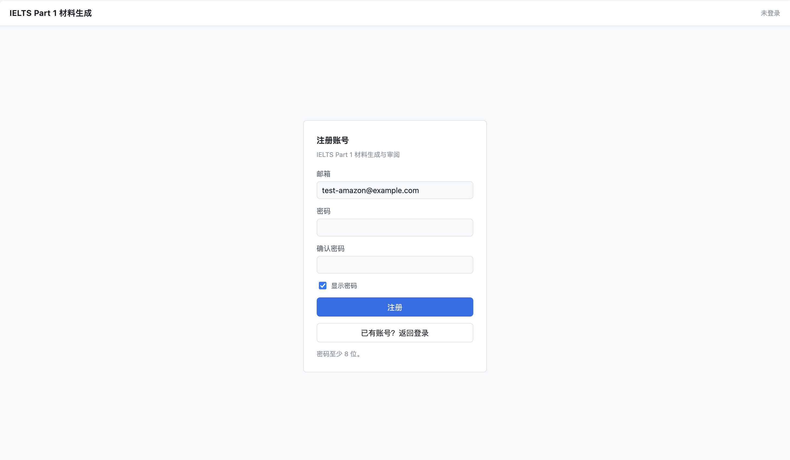

---

## 1. 生成一批材料

在“场景选择”页面：

1. 勾选需要的场景；
2. 设置每个场景生成几套，默认每个场景生成 2 套；
3. 也可以填写一个自定义场景；
4. 点击“提交生成”。

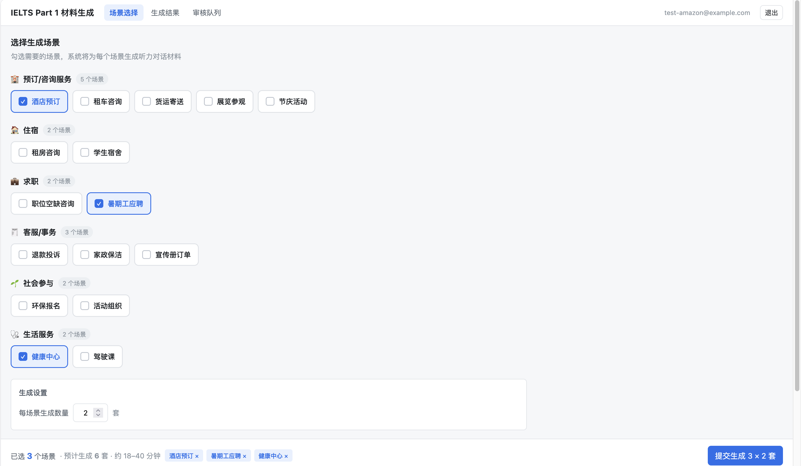

提交后会进入结果页。系统同时生成多套，其余任务自动排队。每套只有在听力材料和 10 道题都完成后，
才会计入“已完成”数量。

你可以离开或刷新页面，后台任务不会中断。重新打开“生成结果”即可继续查看进度。

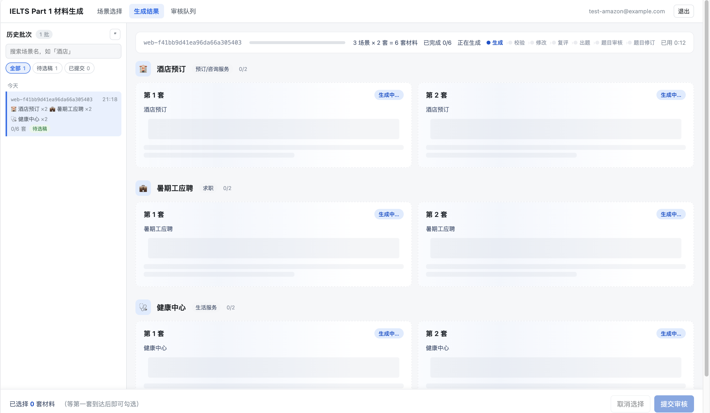

全部完成后，结果页会显示每个场景的完成数量和对应材料卡片。点击卡片上的“阅读全文”即可开始审阅。

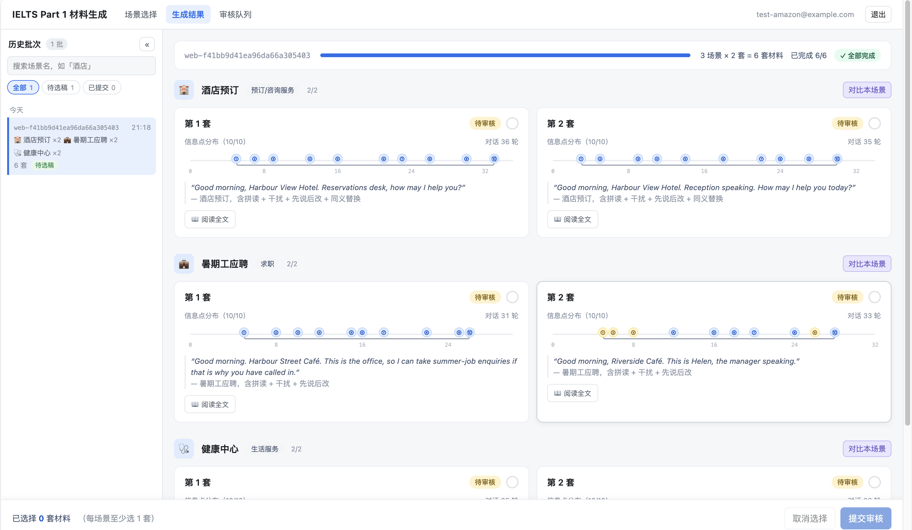

每张材料卡会同时预览最终题组，例如：

- `Q1–Q4 · Form`
- `Q5–Q10 · Note`

每套固定分为两组，分界可能是 `4+6`、`5+5` 或 `6+4`。两组可以使用相同题型，也可以分别使用
Form、Note、Table 中的不同题型。

> 📷 **替换截图：`04-batch-completed.png`**
>
> 1. 打开一批已经全部生成成功的“生成结果”页面；
> 2. 找到一张题目也已生成完成的材料卡；
> 3. 截图中必须完整显示场景标题、完成状态、信息点时间轴、两组题型标签和“阅读全文”按钮；
> 4. 两组题型标签必须能看清题号范围，例如 `Q1–Q4 · Form`、`Q5–Q10 · Note`。

### 某一套生成失败怎么办

已成功的套件可以照常使用。点击“补生成这一套”后，系统只补缺失的位置：

- 仍在当前批次和当前面板中生成；
- 不会重跑已经成功的套件；
- 成功后会从 `8/9` 自动变成 `9/9`；
- 失败提示会自动消失。

> 📷 **待补截图：`05-refill-failed-slot.png`**
>
> 1. 打开一个存在单套生成失败、但其他材料已经成功的批次；
> 2. 不要点击重跑整批；
> 3. 截图中必须显示失败数量、失败原因说明、已经成功的材料数量和“补生成这一套”按钮；
> 4. 如果当前没有自然失败批次，保留占位符，不需要故意制造故障。

---

## 2. 查看一套材料

点击卡片上的“阅读全文”。页面包含两个页签。

### 对话原文

这里可以查看：

- 完整对话和信息点分布；
- 原文中的答案证据高亮；
- 每个信息点的类型和引用；
- 考点小结、可用题型和篇幅；
- 音频播放器。

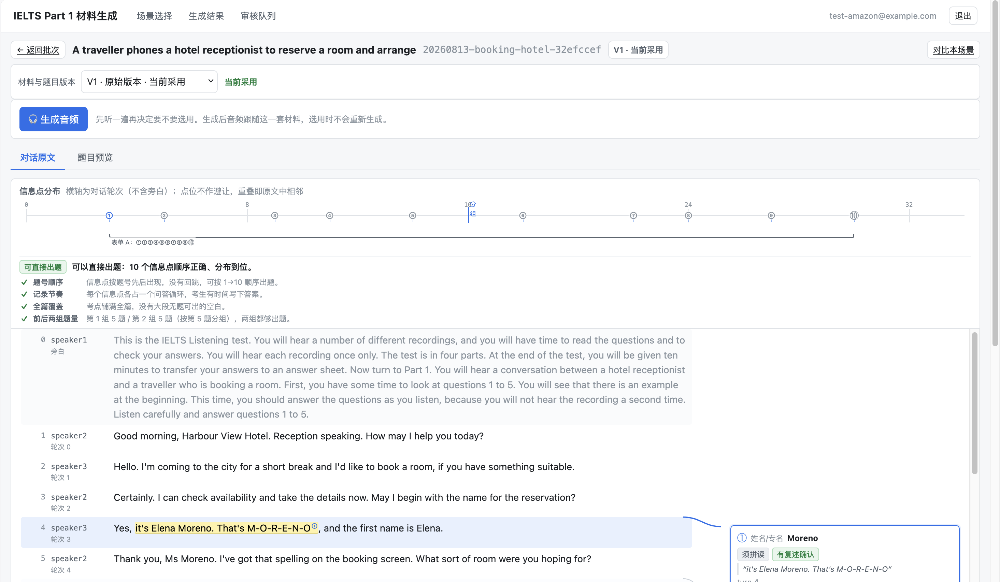

> 📷 **替换截图：`06-material-transcript.png`**
>
> 1. 打开一套已经生成题目的材料，停留在“对话原文”页签；
> 2. 将页面滚动到既能看到若干对话 Turn，又能看到下方“材料原文局部修改”和右侧“Turn 批注”的位置；
> 3. 截图中必须显示至少一个答案信息点旁注、Turn 编号、材料原文局部修改说明和“分析并局部修改”按钮；
> 4. 不要选中旁白 Turn，避免截图中出现不可修改状态。

### 题目预览

这里按真实版式展示 Form、Note 或 Table。默认是考生视角；打开“显示答案和证据”后，可以检查答案、
原文证据和题解。

点击一道题即可选中 Q1-Q10，并在右侧提交评价。

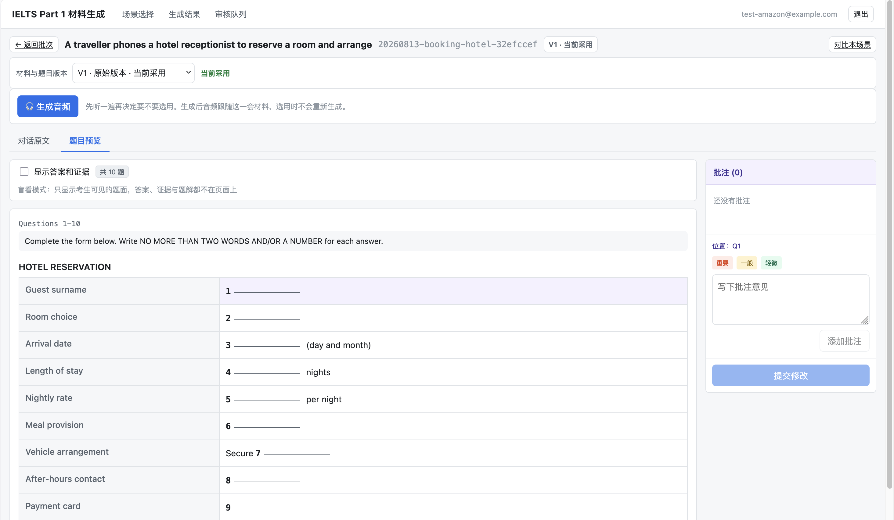

> 📷 **替换截图：`07-question-preview.png`**
>
> 1. 在同一套材料中切换到“题目预览”；
> 2. 保持“显示答案和证据”关闭；
> 3. 截图中必须显示“材料与题目版本”选择器、“导出 QTI 2.2（Vn）”按钮、两组题面和右侧题目批注区；
> 4. 尽量让第一组的题号范围和题型标题完整可见。

打开“显示答案和证据”后，答案、原文引证和题解会显示在对应题目下方。

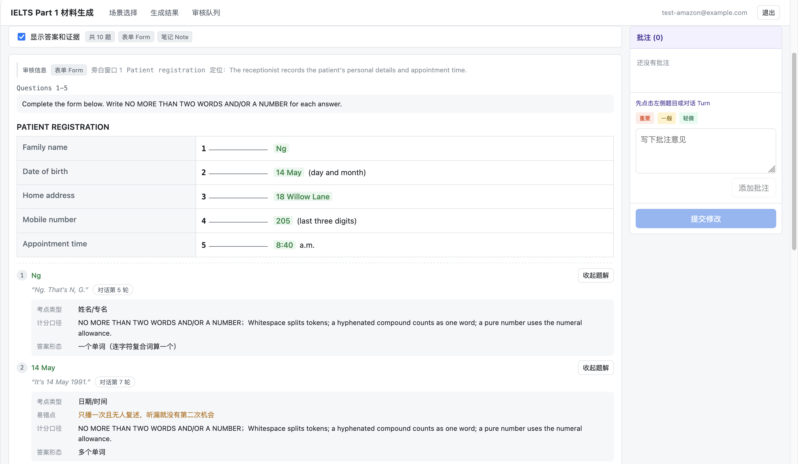

### 导出给下游系统（QTI 2.2）

题目预览上方的「导出 QTI 2.2（Vn）」按钮会把**当前显示的这一版**题目打成一个 zip 下载，按
IMS QTI 2.2.4 标准打包，可直接导入支持该标准的题库或考试系统。按钮上的 Vn 就是版本选择器里
选中的版本；想导出别的版本，先切换版本再点导出。

下载完成后，可以在浏览器下载列表中查看 zip 文件名。压缩包内还包含 `review.txt`，记录需要人工
确认的判分口径（例如某个短语的简写算不算对），导入前请打开看一遍。包里不含音频，音频需要另行
交付给下游。

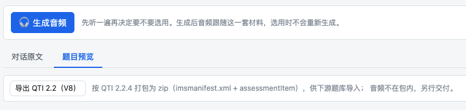

点击后，浏览器会下载一个以材料 ID 和版本号命名的 zip，例如下图中的
`ielts-20260903-booking-hotel-108c471b-v7.zip`。文件名中的 `v7` 表示这次下载的是 V7。上图展示的
按钮是另一次查看 V8 时的状态；实际使用时，按钮和新下载文件的版本号应与当前选择的版本一致。

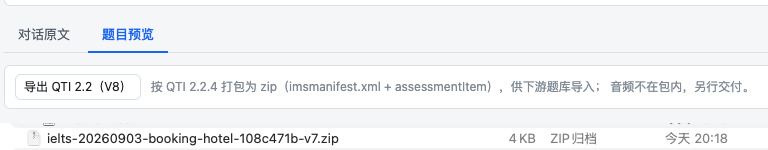

如果提示「未通过导出门禁」，说明这一版题目的审核数据本身有不一致之处（提示里会逐条列出原因），
重试不会有变化；请先按第 5 节修改题目，生成新版本后再导出。

---

## 3. 试听

在阅读页点击“生成音频”。首次生成需要等待一段时间，完成后可以：

- 播放全文；
- 调整倍速；
- 按 Turn 播放；
- 自动跟随当前原文。

试听不会自动选稿。音频属于当前材料版本，之后采用该版本时不需要重复生成。

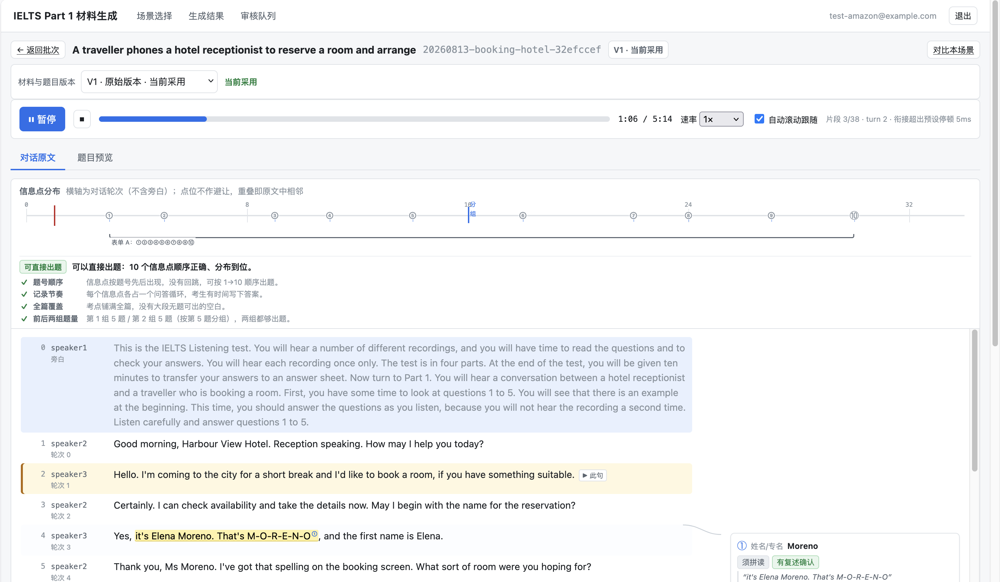

---

## 4. 评价并局部修改材料原文

客户可以直接对某一个对话 Turn 提交小范围修改，例如：

- 删除不承载答案的冗余礼貌语；
- 缩短不影响信息点的表达；
- 修正局部语法或自然度；
- 删除不再需要的复述确认。

局部修改一次只处理一个非旁白 Turn。系统不会借此重写整段对话，也不会修改题面、答案、题型、题组
或答案信息点。

### 提交 Turn 批注

1. 打开“对话原文”；
2. 点击需要修改的非旁白 Turn；
3. 在右侧选择“重要 / 一般 / 轻微”；
4. 写清楚需要保留和删除的内容；
5. 点击“添加批注”；
6. 确认当前只有一条待处理的 Turn 批注后，点击“分析并局部修改”。

例如：

```text
复述预订编号显得多余，请删除编号复述，
只保留 “Thank you. I will save that with my travel details.”
```

下图中，Turn 29 被选中，右侧已经保存了一条“一般”批注。确认意见无误后，点击右下角
“分析并局部修改”：

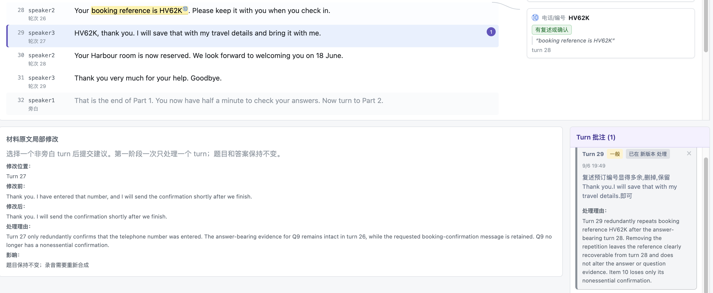

### 查看处理进度

开始处理后，按钮会暂时禁用，左侧显示目标 Turn 和处理步骤：

1. 已接收请求；
2. 分析局部修改；
3. 校验材料、信息点和题目；
4. 独立复核；
5. 生成新版本。

处理期间可以刷新或离开页面，重新进入后会恢复当前进度。请勿重复提交。

### 修改成功

修改通过后会生成新的材料与题目版本，但不会自动采用。结果区域会显示：

- 修改位置；
- 修改前原文；
- 修改后原文；
- 处理理由；
- 题目保持不变；
- 录音需要重新合成。

如果删除的是冗余复述确认，对应信息点上的“有复述或确认”标签也会在新版本中消失；答案和原文证据
仍保持不变。

下图展示了局部修改完成后的实际页面：

- “材料原文局部修改”区域列出修改位置、修改前、修改后、处理理由和影响；
- 右侧批注显示“已在新版本处理”；
- 版本选择器显示当前采用版本；
- 黄色提示说明该版本修改了听力原文，需要生成新版录音；
- Q9、Q10 的答案承载句仍保留，题目和答案没有变化。

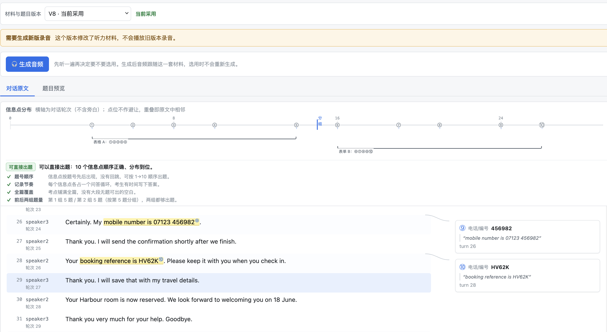

### 哪些修改会被拒绝

如果意见会改变以下内容，系统会返回“会影响题目或答案”，不会生成新版本：

- 删除答案本身或唯一答案证据；
- 改变标准答案或可接受答案；
- 删除纠错链、拼写过程或消歧所必需的确认；
- 改变题型、题组、题号或信息点；
- 大范围重写、增删或重排 Turn。

普通复述即使删除后使整套材料少于三个 confirmed 信息点，也只作为质量提醒，不会单独阻止人工局部
修改。初始材料生成仍保持至少三个 confirmed 信息点的要求。

例如，要求把整个场景从“酒店预订”改为“餐厅订位”，并调整全部对话，已经不是单个 Turn 的局部
修改。系统会把批注标记为“超出局部范围”，说明它会影响多个 Turn、证据、信息点和题目支持关系，
且不会生成新版本。

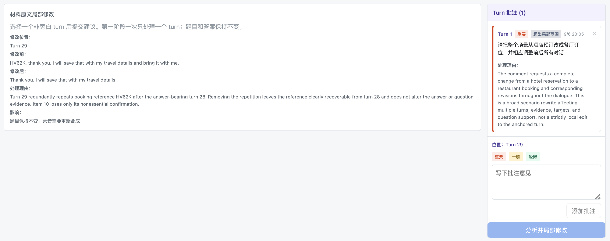

### 局部修改失败后怎么办

如果系统质量复核失败，页面会显示“处理失败”和具体原因。原版本不会改变，原 Turn 批注仍保留为待处理
状态。修复系统问题或调整意见后，可以直接再次点击“分析并局部修改”，不需要重新添加同一条批注。

---

## 5. 评价并修改题目

在“题目预览”中：

1. 点击需要评价的题目，确认该题已被选中；
2. 选择“重要 / 一般 / 轻微”；
3. 输入修改意见；
4. 点击“添加”，完成评价提交。

系统会先判断意见应该如何处理，不会立即覆盖现有内容。

> **注意：** 必须先选中题目并选择重要程度，填写修改意见后再点击“添加”，评价才会提交成功。

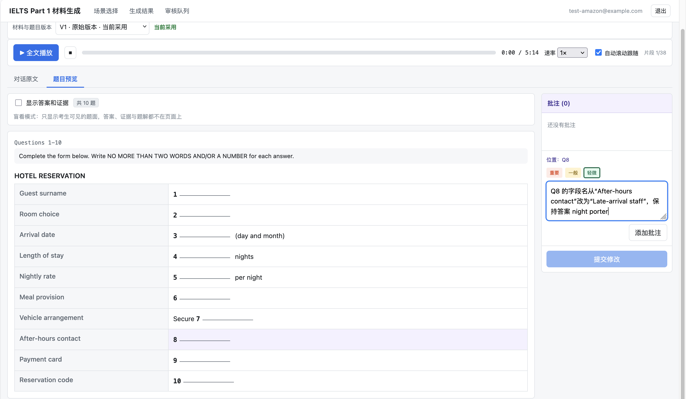

添加批注后，点击“提交修改”才会开始处理。页面随后会显示当前修改步骤；处理过程中无需重复提交。

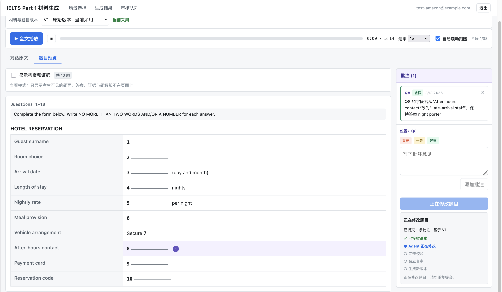

### 四种处理结果

| 页面结果 | 代表什么 | 你需要做什么 |
| --- | --- | --- |
| **无需修改** | 当前内容已经满足要求，或意见不成立 | 查看系统给出的理由和引证 |
| **修改题目** | 只需调整题面、答案或证据 | 等待新版本生成 |
| **需要重新命题** | 需要调整题型、题组、布局或信息点规划 | 点击“确认重新命题” |
| **需要修改材料** | 当前听力原文不支持目标答案或要求 | 点击“确认修改材料” |

> 📷 **待补截图：`10-revision-results.png`**
>
> 1. 打开一套已经处理过题目批注的材料；
> 2. 选择一个能看到“无需修改”“需要重新命题”或“需要修改材料”结果的版本；
> 3. 截图中至少完整显示一个处理结果标题、系统理由、原文引证和可执行按钮；
> 4. 如果同一屏能放下两个不同结果，可以一起截图；不要为了凑四种结果拼接图片。

### 修改题目

局部修改只处理评价所指向的题目，并保持其他题和听力原文不变。修改通过质量检查后才会生成新版本。

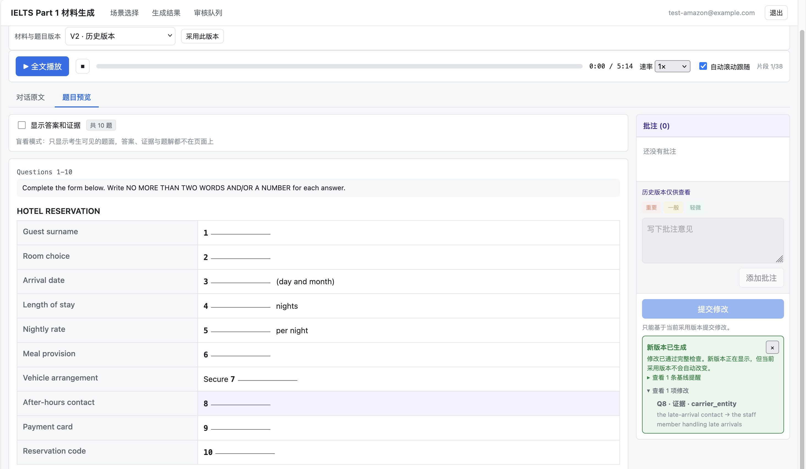

### 重新命题

适合以下需求：

- 将一组题从 Form 改成 Note；
- 重新组织字段；
- 调整题组边界；
- 更换或重新规划答案信息点。

如果只要求调整布局，系统会尽量保留原听力材料和原有答案信息点。确认后会重建完整 10 道题。

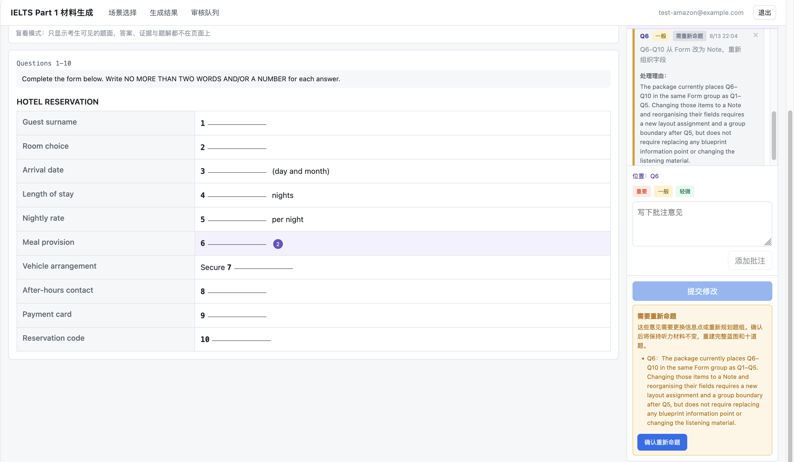

重新命题完成后，页面会显示新题目版本和具体修改内容。

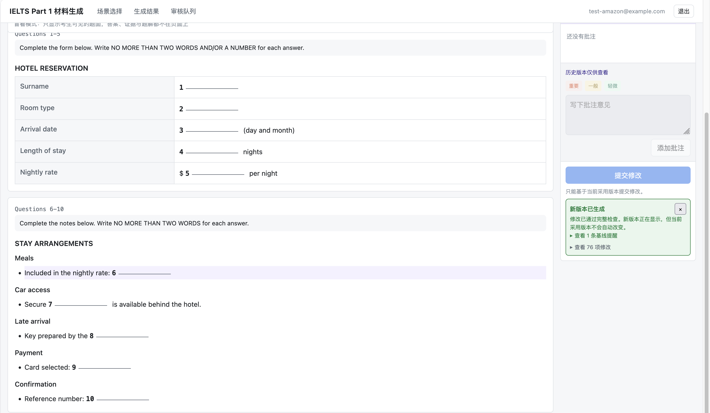

### 修改材料

当目标答案在原文中不存在时，不能只改题目。例如把 `three nights` 改为 `four nights`，必须先修改
听力对话，再重建蓝图和完整 10 道题。

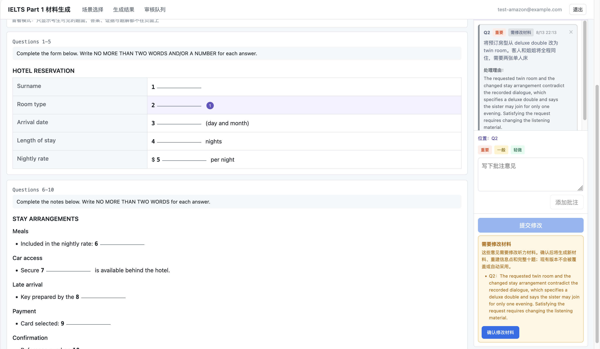

材料修改完成后，新版本会提示重新生成音频，避免继续播放旧版本录音。

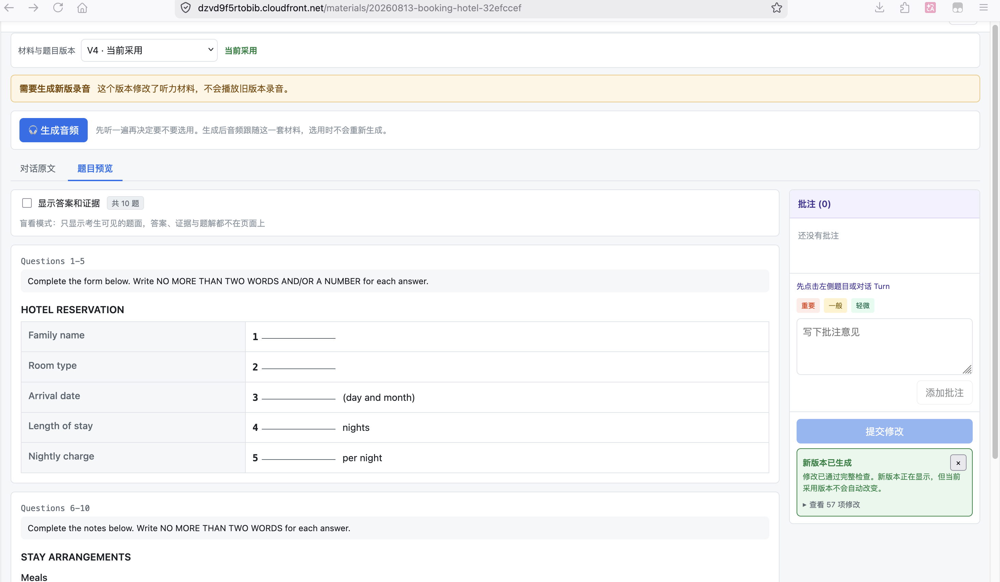

### 修改过程中可以离开页面吗

可以。题目修改、重新命题和材料修改都在后台继续运行。刷新或离开页面不会中断任务，回来后会恢复
当前进度。

题目修改或材料修改通常需要约 15 分钟。页面没有显示失败提示时，说明任务仍在处理中，请耐心等待，
不要重复提交。

如果任务失败，点击页面上的“重新尝试命题”或“重新尝试修改材料”。系统会沿用原意见启动新的执行，
不需要删除后重新写批注。

如果意见需要大幅修改听力材料，自动修改不一定能够通过完整质量检查。遇到这种情况，建议返回场景
选择页重新生成一套材料，不要连续重复尝试修改。

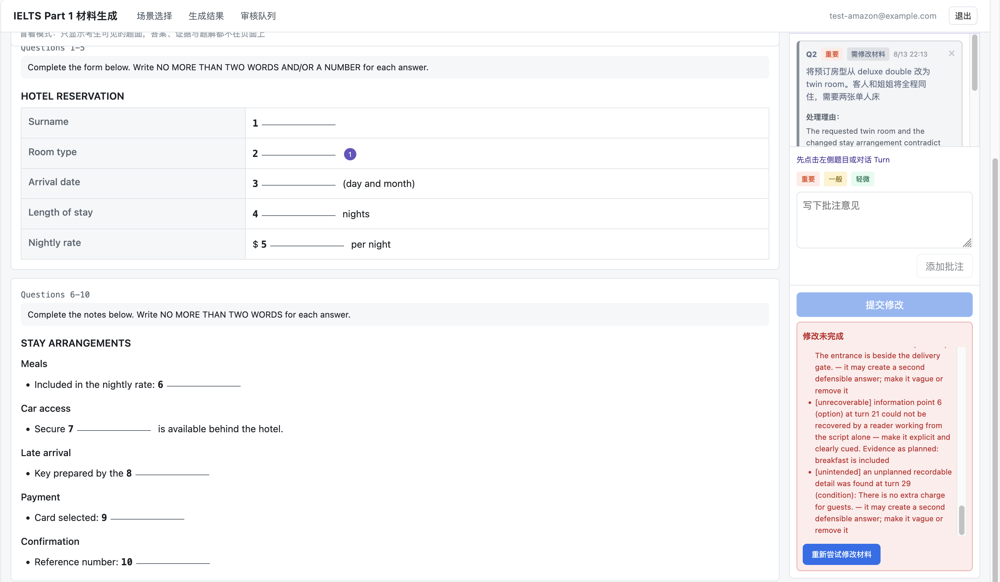

---

## 6. 查看和采用版本

修改成功后会生成 V2、V3 等新版本，但**不会自动采用**。

在“材料与题目版本”中切换版本进行检查。切换时以下内容会一起变化：

- 听力材料；
- 蓝图和题目；
- 答案与证据；
- 对应音频。

确认新版本合适后，再点击“采用”。之后的新修改会基于当前采用版本继续生成。

> **注意：** 如果要在新版本上继续评价，必须先点击“采用”。仅切换到新版本查看，不会改变后续评价
> 所基于的版本。

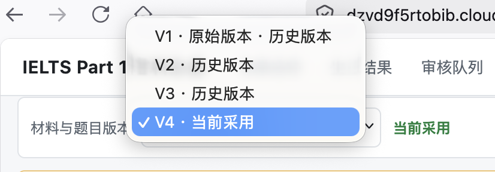

---

## 7. 对比、选稿和提交

### 对比同场景材料

同一场景有 2 套以上时，点击“对比本场景”，再选择 A、B 两套。页面会并排显示信息点、题型、篇幅和
考点差异。对比页只帮助判断，不会自动选稿。

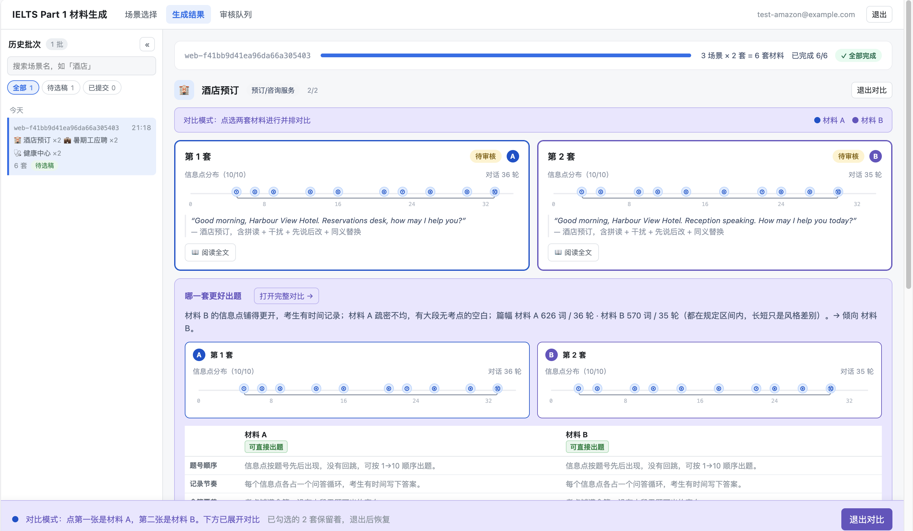

### 选稿

回到结果页，勾选需要保留的材料。每个已有结果的场景至少选择 1 套，之后点击“提交审核”。

> 📷 **待补截图：`16-material-selection.png`**
>
> 1. 打开一批已经生成完成、尚未提交审核的结果；
> 2. 在至少两个场景中各勾选一套材料；
> 3. 截图中必须显示卡片勾选状态、每个场景的已选数量、页面底部总计和“提交审核”按钮；
> 4. 截图前不要真正点击提交，以便保留可操作状态。

### 审核队列

点击“提交审核”后，所选材料会进入顶部导航中的“审核队列”。审核队列按提交批次分组显示材料；如需
继续调整选择，可以撤回整批，返回生成结果页重新选稿。

> 📷 **新增截图：`24-review-queue.png`**
>
> 1. 在“生成结果”页勾选至少一套材料并点击“提交审核”；
> 2. 点击顶部“审核队列”；
> 3. 截图中必须显示已提交批次、材料数量或材料列表、提交状态和“撤回”操作；
> 4. 使用测试批次，不要截入个人邮箱或其他敏感信息。

### 查看历史

结果页左侧可以打开历史批次，按场景或状态查找：

- **待选稿**：可以继续选择和提交；
- **已提交**：只读，可以查看和试听；

> 📷 **待补截图：`17-batch-history.png`**
>
> 1. 打开顶部“生成结果”，展开页面左侧历史批次面板；
> 2. 让列表中同时出现至少一个“待选稿”和一个“已提交”批次；
> 3. 截图中必须显示批次时间、场景或数量摘要、状态标签和当前选中的批次；
> 4. 已提交批次应能看出只读状态。

---

## 8. 常见问题

### 页面刷新后任务不见了吗

不会。生成和修改由服务器继续执行，重新进入原批次或原材料即可恢复。

### 为什么生成了新版本，页面内容却没有自动变

新版本不会自动采用。请在版本选择器中检查并手动采用。

### 为什么系统要求修改材料

说明目标答案或要求在当前听力原文中没有依据。只改题目会产生无法从录音中听到的答案。

### 为什么修改没有通过

新版本仍须通过完整质量检查。页面会显示主要失败原因；可以按提示调整意见，或点击重新尝试。

### 为什么删除复述后“有复述或确认”标签消失了

这是正常现象。该标签来自当前版本蓝图中的 `confirmed` 状态。删除非必要复述后，系统会将对应信息点
标记为未确认，但答案、证据和题目仍保持不变。

---

## 9. 名词说明

| 名称 | 含义 |
| --- | --- |
| 批次 | 一次提交生成的全部材料 |
| 套件 | 一段听力对话及对应的 10 道题 |
| 信息点 | 录音中可作为答案的具体细节 |
| 批注 / 评价 | 针对某一道题提交的修改意见 |
| 版本 | 一套相互对应的材料、蓝图、题目、答案和证据 |
| 当前采用 | 正式显示并作为下一次修改基础的版本 |
| 旁注 | 对话原文右侧解释信息点的小卡片，不是用户评价 |
| Turn 批注 | 针对某一句对话原文提交的局部修改意见 |
| QTI 包 | 按 IMS QTI 2.2.4 标准打包的一版题目（zip），供下游题库或考试系统导入 |
